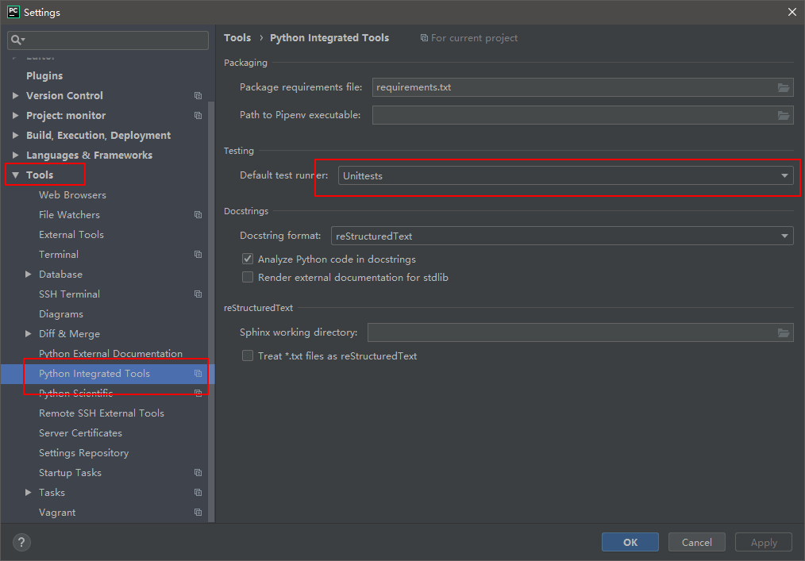
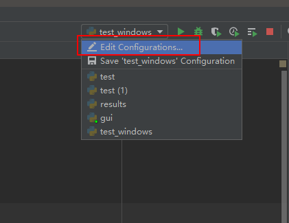
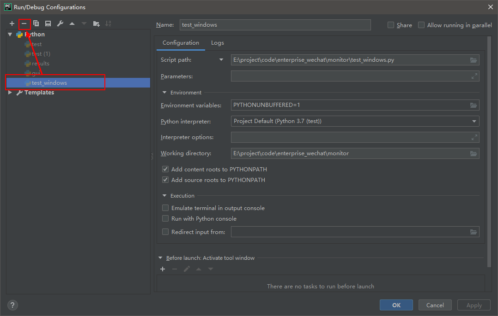
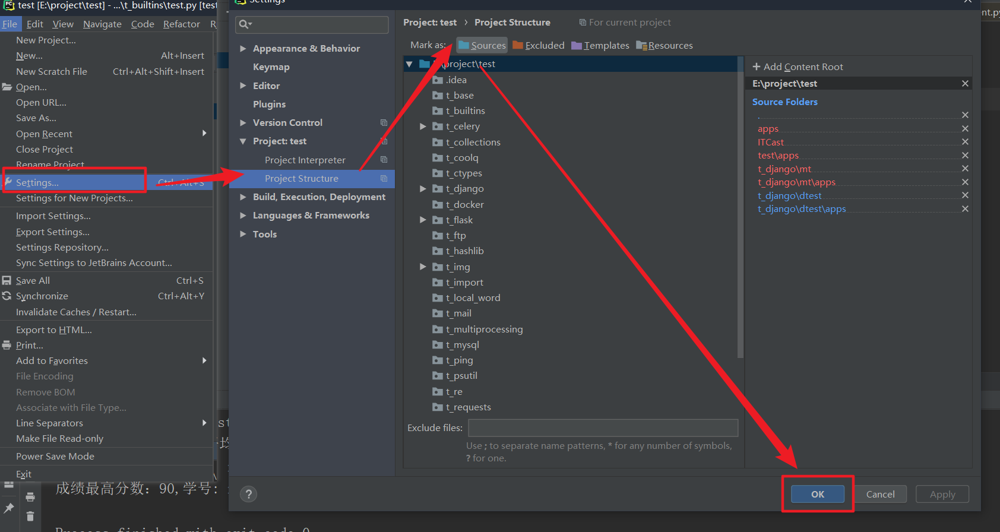

# 1. 安装

官方文件: [下载](https://www.jetbrains.com/pycharm/download/#section=windows)

## 1.1 windows

无脑安装即可

## 1.2 Linux

将下载后的文件, 解压, 然后:

```bash
./PyCharm.sh  # 即可运行程序
```

启动PyCharm后, 可以创建桌面快捷方式:

```bash
依次点击按钮: Tools --> Create Desktop Entry...
```

# 2. 激活

## 2.1 激活码激活

### 2.1.1 修改hosts文件

文件路径:

* windows: `C:\windows\system32\drivers\etc\host`   (注意window需要使用administrator才能编辑此文件)
* linux: `/etc/hosts`

增加如下信息:

```bash
0.0.0.0 account.jetbrains.com
```

### 2.1.2 激活

输入对应的激活码即可

### 2.2 暴力激活

破解工具: [下载](./image/05-PyCharm%E4%BD%BF%E7%94%A8/jt.jar)

1. 打开PyCharm

2. 依次点击:

   ```bash
   Help --> Edit Custom VM Options
   ```

3. 编辑跳出来的界面

   将`-javaagent`参数指向破解文件的路径即可

   ```bash
   -javaagent:D:\PyCharm\jt.jar
   ```

4. 保存重新运行PyCharm即可

# 3. 快捷键

## 3.1 键盘快捷键

| 序号 | 快捷键        | 作用                  |
| ---- | ------------- | --------------------- |
| 1    | Alt+1         | 地址栏打开/隐藏       |
| 2    | ctrl+y        | 删除选中/当前行       |
| 3    | ctrl+d        | 复制选中/当前行       |
| 4    | ctr+shift+↑/↓ | 移动选中/当前行       |
| 5    | xxx.print     | 可以直接把xxx打印     |
| 6    | shift+F6      | 替换名字              |
| 7    | shift+ctrl+z  | 反向撤回              |
| 8    | ctrl+alt+l    | 自动效正格式          |
| 9    | ctrl+q        | 查看函数文档注释      |
| 10   | ctrl+alt+m    | 重构函数(方法抽取)    |
| 11   | alt+enter     | 推荐修复              |
| 12   | ctrl+atl+v    | 自动创建变量/实例对象 |
| 13   | ctrl+shift+u  | 大小写转换            |
| 14   | ctrl+r        | 正则查找              |

## 3.2 鼠标快捷键

```bash
Add or remove Caret  # 鼠标多光标选中
Change font (Zoom) with Ctrl+Mouse Wheel  # 鼠标放大缩小字体
```

# 4. 操作

## 4.1 头文件配置

依次点击:

```bash
File->settings->Editor->File and Code Templates->Python Script 
```

添加如下信息:

```bash
# -*- coding:utf-8 -*-
# author: HPCM
# time: ${DATE} ${TIME}
# file: ${NAME}.py
```

## 4.2 PyCharm用root运行Python

创建运行环境`vim Python_root.sh`, 添加如下信息:

```bash
#!bin/bash
sudo /home/hpcm/.virtualenvs/py3/bin/python3.5 "$@"
```

设置免密以root方式运行脚本

```bash
sudo visudo
```

添加如下信息

```bash
%sudo ALL=NOPASSWD:/home/hpcm/.virtualenvs/py3/bin/python3.5
```

保存退出

```bash
ctrl+o
Enter
ctrl+x 
```

设置Python解释器为`Python_root.sh`即可

## 4.3 禁用test模式



然后删除当前运行的配置:





然后重新运行即可

## 4.2 git变更代码后文件问题

场景描述:

主要是由于git代码分支切换, 导致部分文件不能正常显示

处理方案

* 方法一: 重新载入项目

  


* 方法二: 直接删除PyCharm项目缓存

  找到`.idea`隐藏文件, 直接干掉. 然后重新导入项目即可