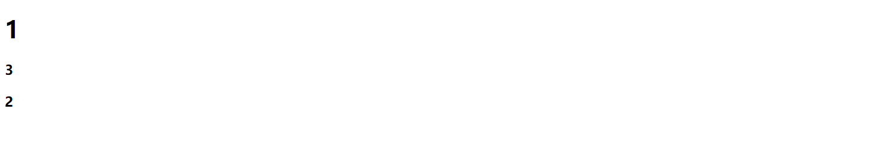
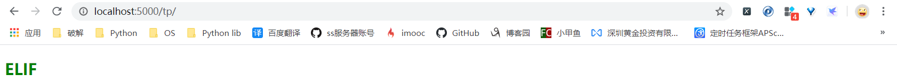
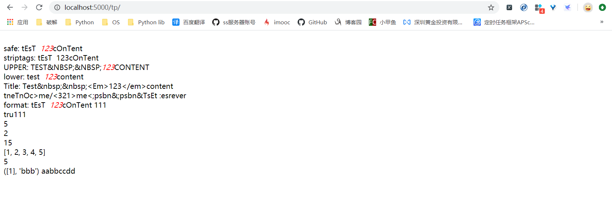
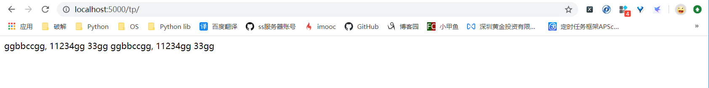
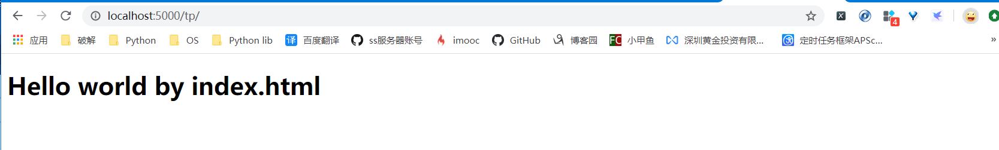

 

# 1. 模板渲染

flask模板渲染是基于werkzeug模块对html按指定语法进行批量替换的操作

## 1.1 render_template

```python
def render_template(template_name_or_list, **context)
```

* template_name_or_list:

  str/iter[0], 需要渲染的模块. 如果为可迭代对象时, 则去迭代的第一项进行渲染

* context:

  关键字参数, 需要替换的内容

## 1.2 helloword

* web api

  ```python
  @bp_template.route("/")
  def url1():
      context = 1
      test = {
          "a": 3,
          "b": 2
      }
      return render_template("index.html", context=context, test=test)
  ```

* 模板文件

  ```python
  <body>
  <h1>{{ context }}</h1>
  <h3>{{ test.a }}</h3>
  <h3>{{ test.b }}</h3>
  </body>
  ```

  

* 渲染结果

  

# 2. 模板语言

## 2.1 代码块

`{{ xx }}`, 将`xx`替换为api中`render_template`传入的参数即可, 将此部分代码渲染为参数的值

参数的读取关系:

| 传入参数类型      | 读取格式     |
| ----------------- | ------------ |
| `{"a": {"b": 2}}` | `{{ a.b }}`  |
| `class A: b=2`    | `{{ A.b }}`  |
| `a=[1, 2, 3]`     | `{{ a[i] }}` |

## 2.2 遍历操作

```python

...

```

在**循环代码块中**可以进行如下操作:

| 代码块                    | 操作                         |
| ------------------------- | ---------------------------- |
| `{{ loop.index }}`        | 迭代索引值(1开始)            |
| `{{ loop.index0 }}`       | 迭代索引值(0开始)            |
| `{{ loop.revindex }}`     | 迭代结束需要的次数(1开始)    |
| `{{ loop.revindex0 }}`    | 迭代结束需要的次数0开始)     |
| `{{ loop.first }}`        | 判断, 时候为第一次True/False |
| `{{ loop.length }}`       | 获取数据总长度               |
| `{{ loop.cycle(*list) }}` | 循环输出cycle中添加的字符串  |

**示例**

```python
<body>

    {{ loop.index0 }}&nbsp;&nbsp;&nbsp;&nbsp;

<br>*************************************<br>

    {{ loop.revindex0 }}&nbsp;&nbsp;&nbsp;&nbsp;

<br>*************************************<br>

    {{ loop.first }}&nbsp;&nbsp;&nbsp;&nbsp;

<br>*************************************<br>

    {{ loop.length }}&nbsp;&nbsp;&nbsp;&nbsp;

<br>*************************************<br>

    {{ loop.cycle(2, 6, 3) }}&nbsp;&nbsp;&nbsp;&nbsp;

<br>*************************************<br>
</body>
```


输出


## 2.3 条件判断

```python

...

...

```

**示例**

```python
<body>

<h1 style="color: red">IF</h1>

<h2 style="color: green">ELIF</h2>

<h3 style="color: orangered">ELSE</h3>

</body>
```

输出



## 2.4 过滤器

### 2.4.1 内置

#### 2.4.1.1 字符串

* truncate

  截断字符串
  
  ```python
  {{ "aa bbccdd" | truncate(9, False, "...", 0)}}
  ```
  
  * length
  
    需要保留字符串的长度
  
  * killwords
  
    是否强制截断单词(以`" "`为分界符), True/是, False/否
  
  * end
  
    截断后, 再后面追加内容. 此数据长度占用length长度
  
  * leeway
  
    要满足`length + leeway < len(s)`, 否则字符串不会进行任何处理
  
* format

  识别字符串中特定的占位符, 并进行替换操作

  ```python
  {{ "xx%s, %s" | format("a", "b")}}
  {{ "xx%(a)s, %(b)s" | format(a="a", b="b")}}
  ```

  * 支持Python的占位符语法
  * 支持使用关键字参数传递, 但是不可以交叉使用位置参数和关键字参数

* attr

  动态获取obj中的attr

  ```python
  {{ "aa bbccdd" | truncate(9, False, "...", 0)}}
  ```

  

| 过滤函数    | 作用                                       |
| ----------- | ------------------------------------------ |
| {{ "xx" \| safe }}       |启用标签转换                        |
| {{ "xx" \| striptags}}   | 清除标签转换    |
| {{ "xx" \| trim}}        | 去除前后空格          |
| {{ "xx" \| capitalize}}  | 首字母大写      |
| {{ "xx" \| upper}}       | 大写        |
| {{ "xx" \| lower}}       | 小写 |
| {{ "xx" \| title}}       | 大驼峰       |
| {{ "xx" \| reverse}}     | 翻转   |
| {{ obj \|attr("attr")}} | 动态获取obj.attr |

#### 2.4.1.2 列表过滤器

| 过滤规则 | 作用         |
| -------- | ------------ |
| {{ "xx" \| first}}    | 获取第一个   |
|  {{ "xx" \| last}}     | 获取最后一个 |
| {{ "xx" \| sum}}      | 求和         |
|  {{ "xx" \| sort}}     | 排序         |
| {{ "xx" \| length}}   | 统计长度     |

#### 2.4.1.3 函数过滤器

| 过滤规则  | 作用                   |
| --------- | ---------------------- |
| {{ None \| default("aa", True) }} |如果前面数据为None, 则显示aa|

#### 2.4.1.4 代码块过滤器

```python

xxxxxx


全部修改为过滤的要求, aBB --> abb
```

#### 2.4.1.5 示例

**注意:**

* 过滤规则可以进行链式调用

  ```python
  {{ "xx" | reverse | upper }}
  ```

**示例:**

```python
@bp_template.route("/")
def url1():
    test = [1, 2, 3, 4, 5, 6]
    return render_template("index.html", test=test)

************************************************************************************
<head>
    <meta charset="UTF-8">
    <title>测试 html</title>
    <style>
        em {
            color: red;

        }
    </style>
</head>
<body>
<br>{{ "safe: tEsT&nbsp;&nbsp;<em>123</em>cOnTent" | safe}}
<br>{{ "striptags: tEsT&nbsp;&nbsp;<em>123</em>cOnTent" | striptags}}
<br>{{ "upper: tEsT&nbsp;&nbsp;<em>123</em>cOnTent" | safe | upper}}
<br>{{ "lower: tEsT&nbsp;&nbsp;<em>123</em>cOnTent" | safe | lower}}
<br>{{ "title: tEsT&nbsp;&nbsp;<em>123</em>cOnTent" | safe | title}}
<br>{{ "reverse: tEsT&nbsp;&nbsp;<em>123</em>cOnTent" | safe | reverse}}
<br>{{ "format: tEsT&nbsp;&nbsp;<em>123</em>cOnTent %d" | safe | format(111)}}
<br>{{ "truncate: tEsT&nbsp;&nbsp;<em>123</em>cOnTent" | truncate(16, False, '尾部增加', 0)}}
<br>{{ [5, 3, 4, 1, 2] | first }}
<br>{{ [5, 3, 4, 1, 2] | last }}
<br>{{ [5, 3, 4, 1, 2] | sum }}
<br>{{ [5, 3, 4, 1, 2] | sort(False) }}
<br>{{ [5, 3, 4, 1, 2] | length }}
<br>{{ [1], [] | default("bbb", True) }}

aaBBccDD

</body>
```

输出




### 2.4.2 自定义

#### 2.4.2.1 装饰器

```python
app_template_filter(self, name=None)
```

* name

  需要装饰的函数

#### 2.4.2.2 增加

```python
add_app_template_filter(self, f, name=None)
```

* f

  需要增加的过滤函数

* name

  模板中使用的名称

#### 2.4.2.3 示例

```python
@bp_template.app_template_filter("sub")
def sub(s, reg, replace):
    print(s)
    print(reg)
    print(replace)
    res = re.sub(reg, replace, s, re.S)
    print(res)
    return res


def find(s, reg):
    return True if re.findall(reg, s, re.S) else False


bp_template.add_app_template_filter(find, "find")


***************************************************************************************
<body>
{{ "aabbccaa, 11234aa  33aa" | sub("aa", "gg") }}

aabbccaa, 11234aa
33aa

</body>
```

输出



## 2.5 变量

### 2.5.1 set

只能在定义后使用, 不能再未定义之前使用

```python

{{ massages }}
```

### 2.5.2 with

也可以用with语法, 开启上下文, 作用范围只能在with内部

```python
  # with保证只在此区间类该变量有效
{{ massages }}

```

### 2.5.3 Python变量

模板中是可以直接访问Flask内部变量的

* config
  模板中直接访问Flask当前的config对象
  ```python
  {{config.SQLALCHEMY_DATABASE_URI}}
  sqlite:///database.db
  ```

* request
  当前请求用户的request
  ```python
  {{request.url}}
  http://127.0.0.1
  ```

* g
  上下文变量g, 用于代码传递到模板的内容
  ```python
  {{ g.name }}
  ```

* get_flashed_messages
  flask中通过flask()传入的消息的列表, 就可以通过get_flashed_messages取出该信息
  ```python
  
      {{message}}
  
  ```

* url_for

  重定向

  ```python
  href="{{ url_for('static', file_name="test/css") }}"
  ```

  

## 2.6 模板继承

* 父模板

  ```python
  
  这里是需要修改的代码
  
  ```

  * 定义一个name的代码块

* 子模板

  子模板要想使用父模板的代码块, 需要先继承父模板才能调用

  ```python
  
  
  <h1>Hello world by index.html</h1>
  
  ```

**示例**:

* 父模板

  `father.html`

  ```python
  <!DOCTYPE html>
  <html lang="en">
  <head>
      <meta charset="UTF-8">
      <title>父模板</title>
  </head>
  <body>
  
  <h1>Hello world by father.html</h1>
  
  </body>
  </html>
  ```

* 子模板

  `index.html`

  ```python
  
  
  <h1>Hello world by index.html</h1>
  
  ```

* web api

  ```python
  @bp_template.route("/")
  def url1():
      return render_template("index.html")
  
  ```

效果




