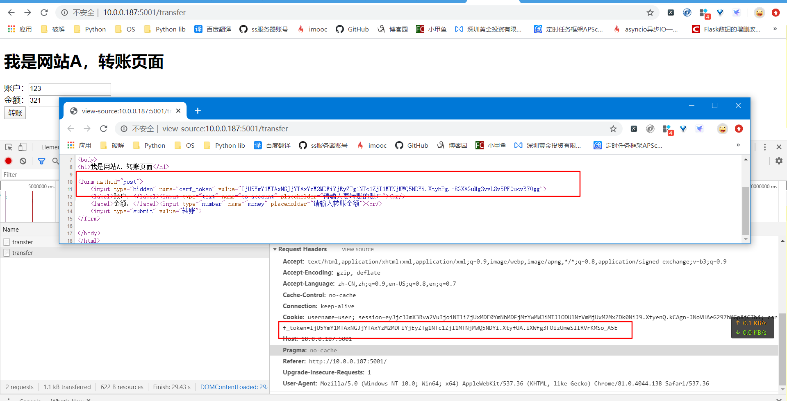
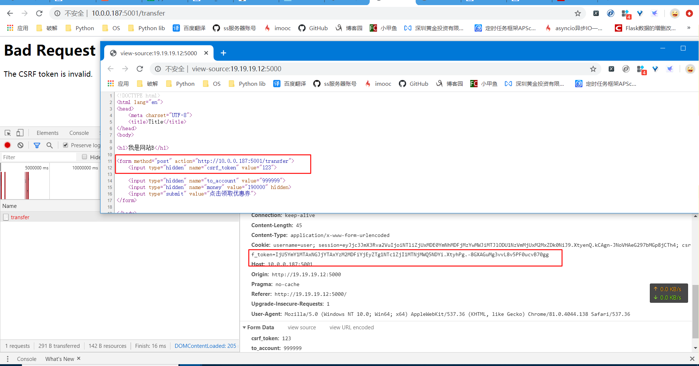

# 1. CSRF保护

## 1.1 保护类型

开启csrf保护后, 请求类型凡是为:

* POST
* PUT
* PATCH
* DELETE

请求头中都必须要加入X-CSRFToken或X-CSRF-Token字段才能访问成功

## 1.2 开启保护

### 1.2.1 web端

* 开启需要保护的app

   ```python
   from flask_wtf import CSRFProtect
   
   CSRFProtect(app)
   ```

* 实时更新csrf_token字段

  此方法系统已经自动执行, 无需再次操作, `generate_csrf`可以用来获取此次的`csrf-token`数据

  ```python
  from flask_wtf.csrf import generate_csrf
  
  # 请求钩子, 在每次调用函数的最后执行
  #@app.after_request
  #def after_request(response):
  #    csrf_token = generate_csrf()  # 利用自带方法随机生成csrf
  #    response.set_cookie("csrf_token", csrf_token)  # 把csrf写入到cookie中
  #    return response
  ```

### 1.2.2 client端

* JavaScript

  ```javascript
  $.ajax({
          url:"/passport/login",
          method: "post",
          headers:{
                  "X-CSRFToken": getCookie("csrf_token")  # 增加此字段
              },
          data: JSON.stringify(params),
          contentType: "application/json",
          success: function (resp) {
              if (resp.errno == "0") {
                  // 刷新当前界面
                  location.reload();
              }else {
                  $("#login-password-err").html(resp.errmsg)
                  $("#login-password-err").show()
              }
          }
  })
  ```

  

### 1.2.3 测试效果

* 站内访问



* 跨域访问



## 1.3 排除CSRF保护

### 1.3.1 原理

 在每次请求之后生成随机csrf_token, 设置给客户端, 当用户提交表单以列表中的形式时, 会以钩子的形式自动调用csrfprotect这个方法进行校验, 如果在exempt的view会自动略过.

相关操作源码如下:

```python
    def init_app(self, app):
        app.extensions['csrf'] = self

        app.config.setdefault('WTF_CSRF_ENABLED', True)
        app.config.setdefault('WTF_CSRF_CHECK_DEFAULT', True)
        app.config['WTF_CSRF_METHODS'] = set(app.config.get(
            'WTF_CSRF_METHODS', ['POST', 'PUT', 'PATCH', 'DELETE']
        ))
        app.config.setdefault('WTF_CSRF_FIELD_NAME', 'csrf_token')
        app.config.setdefault(
            'WTF_CSRF_HEADERS', ['X-CSRFToken', 'X-CSRF-Token']
        )
        app.config.setdefault('WTF_CSRF_TIME_LIMIT', 3600)
        app.config.setdefault('WTF_CSRF_SSL_STRICT', True)

        app.jinja_env.globals['csrf_token'] = generate_csrf
        app.context_processor(lambda: {'csrf_token': generate_csrf})

    @app.before_request
    def csrf_protect():
        if not app.config['WTF_CSRF_ENABLED']:
            return

        if not app.config['WTF_CSRF_CHECK_DEFAULT']:
            return

        if request.method not in app.config['WTF_CSRF_METHODS']:
            return

        if not request.endpoint:
            return

        if request.blueprint in self._exempt_blueprints:
            return

        view = app.view_functions.get(request.endpoint)
        dest = '{0}.{1}'.format(view.__module__, view.__name__)

        if dest in self._exempt_views:
            return

        self.protect()
```

### 1.3.2 过滤CSRF

* 装饰器模式

  ```python
  @app.route('/some-view', methods=['POST'])
  @csrf.exempt
  def some_view():
      ...
  
  ```

  

* 蓝图过滤

  ```python
  bp = Blueprint(...)
  csrf.exempt(bp)
  ```

  