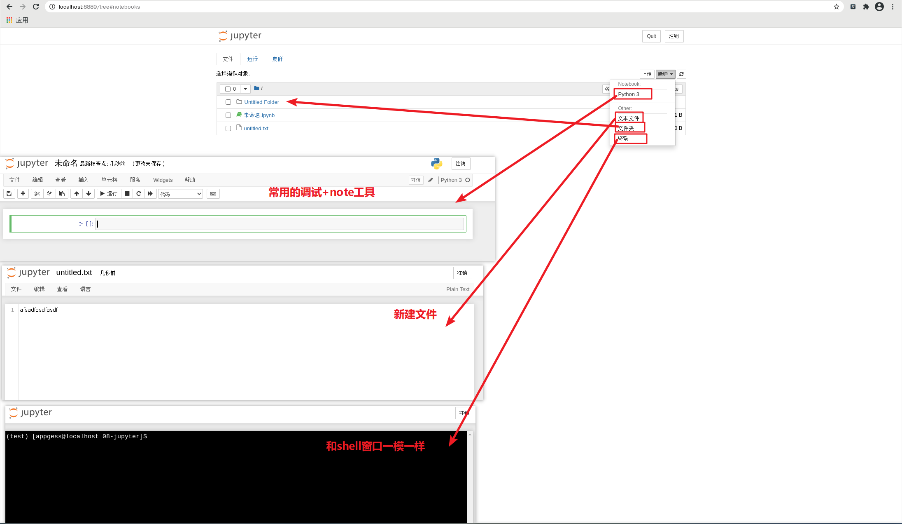

# Jupyter

Jupyter项目是一个非盈利的开源项目，源于2014年的ipython项目，因为它逐渐发展为支持跨所有编程语言的交互式数据科学和科学计算

- Jupyter Notebook，原名IPython Notbook，是IPython的加强网页版，一个开源Web应用程序
- 名字源自Julia、Python 和 R（数据科学的三种开源语言）
- 是一款程序员和科学工作者的**编程/文档/笔记/展示**软件
- **.ipynb**文件格式是用于计算型叙述的**JSON文档格式**的正式规范

### 安装

```shell
pip install jupyter
```

jupyter依赖于ipython

### 使用

```shell
# 直接输入jupyter notebook  即可唤醒浏览器
jupyter notebook
```

我们经常使用的是`.pynb`格式文件, 点击运行--> 新建一个终端即可

