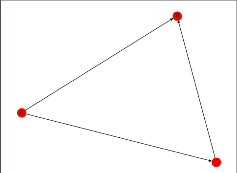

# NetworkX

networkx库主要用于绘制复杂拓扑图, 注意需要和matplotlib联合使用

**官网教程**: https://www.osgeo.cn/networkx/tutorial.html

#### helloworld

```python
import networkx as nx
import matplotlib.pyplot as plt

nodes = (
    "A",
    "B",
    "C"
)

g = nx.DiGraph()
[g.add_node(node) for node in nodes]

edges = (
    ("A", "B"),
    ("A", "C"),
    ("C", "B")
)

g.add_edges_from(edges)
nx.draw(g, with_labels=True, node_color="r")
plt.show()
```

输出

