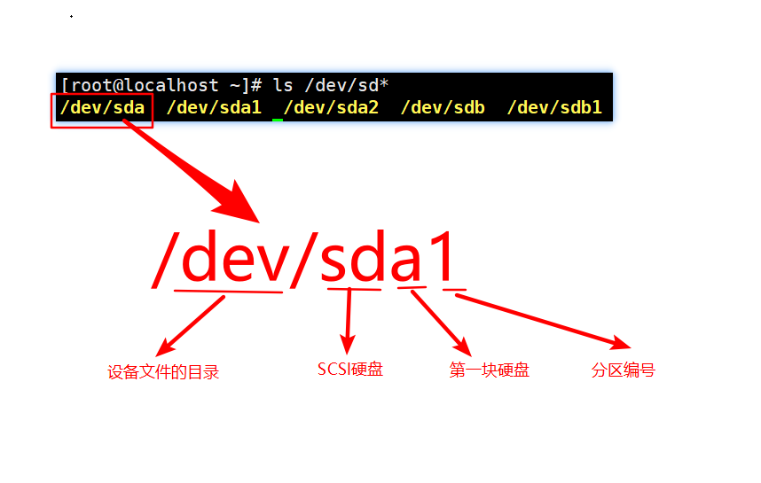

## Linux硬盘分区

MBR: Master Boot Record, 硬盘主引导记录.

硬盘的0柱面, 0磁头, 1扇区称为主引导扇区(主引导记录MBR). 由三部分组成:

* 主引导程序(boot loader), 占用446字节
* 硬盘分区表DPT(Disk Partition table), 占用64字节
* 分区标识符(55AA), 占用2字节.

linux规定: 逻辑分区必须建立在拓展分区之上, 不能建立在主分区之上.

一般分区编号介绍

* 主分区 1 - 4 
* 逻辑分区 5 +

GPT方式分区: 主分区没有限制

