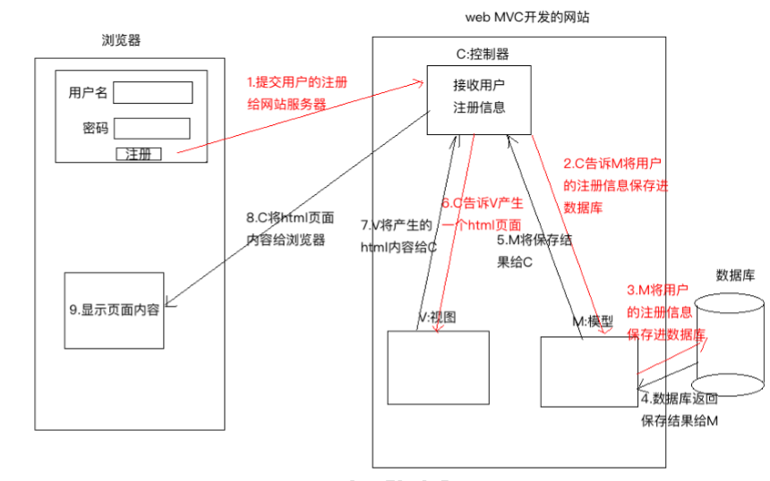
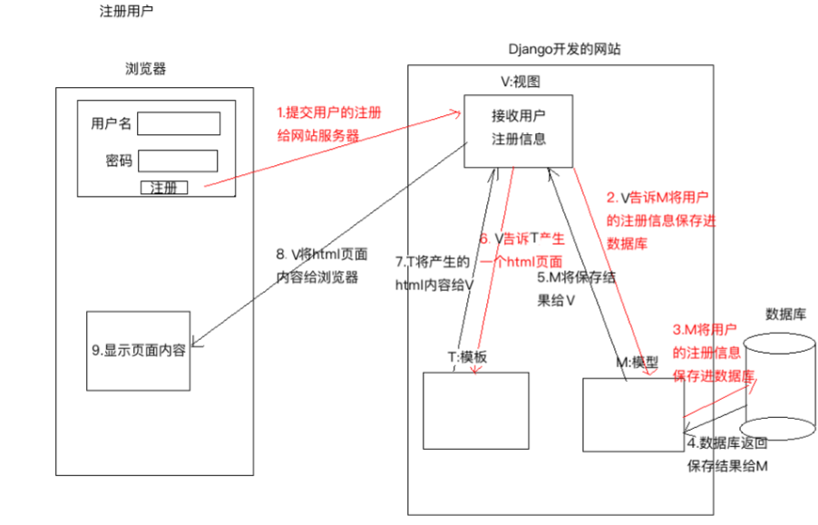

# 1.  Helloworld

## 1.1 django-admin

* 创建项目

  会在当前路径生成一个项目文件夹

  ```python
  django-admin startproject 项目名称
  ```

* 创建app

  会在当前路径生成一个app应用文件夹

  ```python
  django-admin startapp 应用名称
  ```

* 启动项目

  ```python
  python manage.py runserver host:port
  ```

  

## 1.2 helloworld

经过以上命令可以, 生成一个简单的django web. 

* 配置视图函数

  操作文件`views.py`

  ```python
  from django.http import HttpResponse
  from django.shortcuts import render
  
  
  # Create your views here.
  def index(request):
      """主页"""
      return HttpResponse("Hello world")
  ```

* 绑定url与视图关系

  操作文件`urls.py`

  ```python
  from django.conf.urls import url
  from django.contrib import admin
  from user.views import index
  urlpatterns = [
      url(r'^admin/', admin.site.urls),
      url(r"^user/", index)
  ]
  ```

* 激活app

  操作文件`setting.py`, 增加改app对应的配置类

  ```python
  # Application definition
  
  INSTALLED_APPS = [
      'django.contrib.admin',
      'django.contrib.auth',
      'django.contrib.contenttypes',
      'django.contrib.sessions',
      'django.contrib.messages',
      'django.contrib.staticfiles',
      "user.apps.UserConfig"
  ]
  ```

* 运行

  ```python
  python manage.py runserver 0.0.0.0:8000
  ```

  

# 2. 模型介绍

## 2.1 MVC/MVP

* M

  model, 模型, 操作数据库

* V

  view, 视图, 产生HTML页面

* C/P

  Controller/Presenter, 控制器, 接受请求并处理, 主要与M, V进行交互

所以实例如图所示



  一般流程如下:

1. 表单信息提交, 给web服务器
2. C控制器, 通知M保存数据到数据库
3. M将表单信息, 存入数据库
4. M入库后会, 收到数据库返回结果
5. M将结果返回给C
6. C得到结果后, 通知V产生对应的HTML
7. V产生HTML并返回给C
8. C将HTML提供给client
9. client接受到HTML, 进行渲染解析

  

## 2.2 MVT

* M

  Model, 模型, 与数据库交互

* V

  Views, 视图, 接受请求, 进行处理, 与M, P交互

* T

  Template, 模板, 产生HTML




一般流程如下:

1. 表单信息提交, 给web服务器
2. V控制器, 通知M保存数据到数据库
3. M将表单信息, 存入数据库
4. M入库后会, 收到数据库返回结果
5. M将结果返回给V
6. V得到结果后, 通知T产生对应的HTML
7. T产生HTML并返回给V
8. V将HTML提供给client
9. client接受到HTML, 进行渲染解析