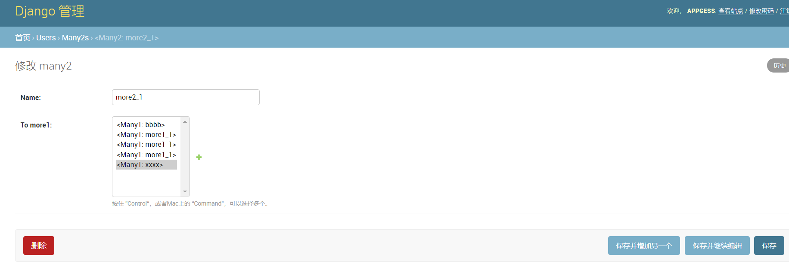
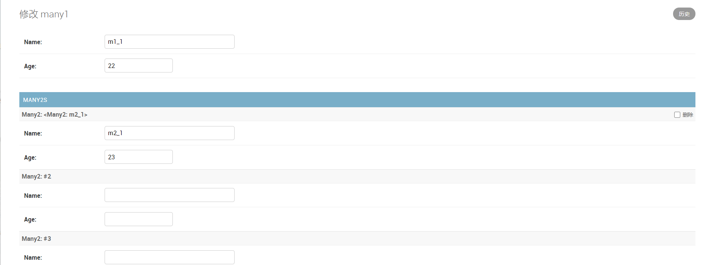
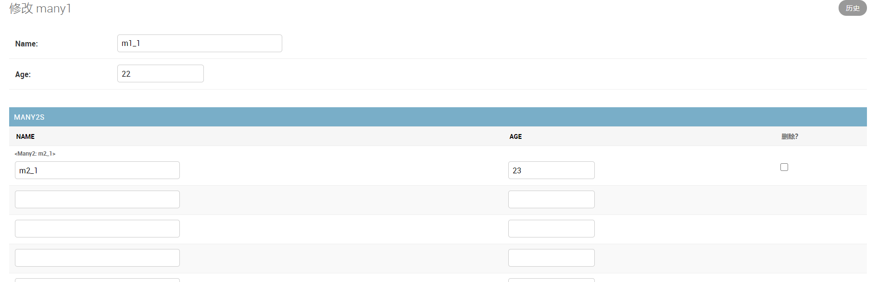
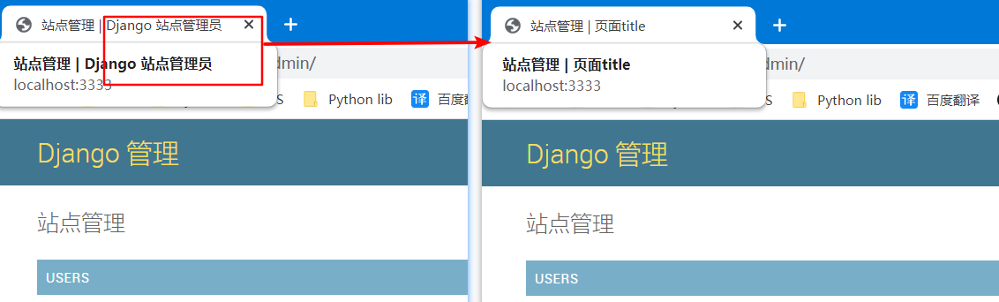
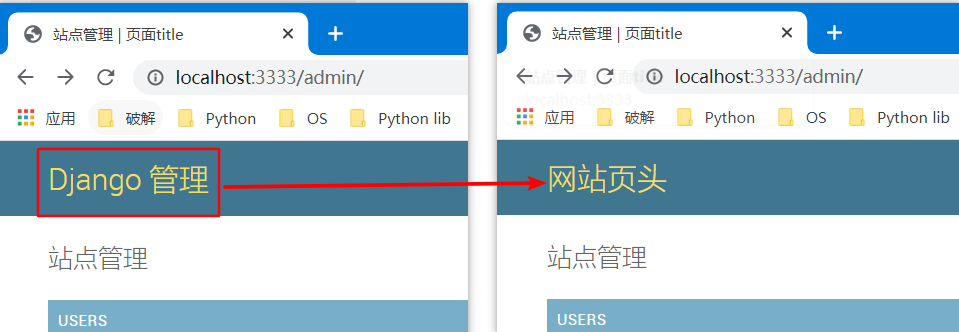
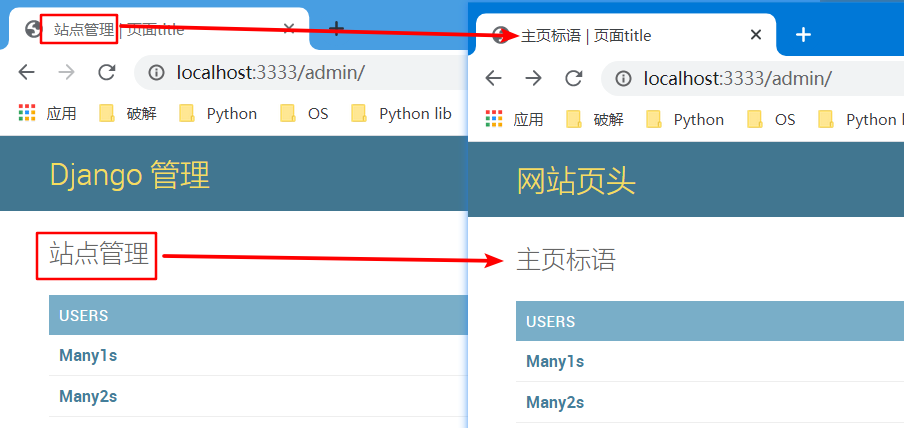
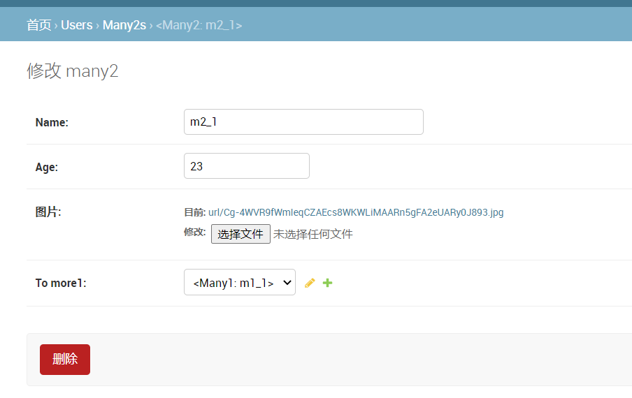

# 1. admin站点

后台管理页面, 连接数据库使用短连接, 而使用`python manage.py shell`使用的长连接

## 1.1 管理员

* 创建

  ```python
  python manager.py createsuperuser
  ```

* 修改

  ```python
  python manage.py changepassword
  ```

## 1.2 语言

```python
LANGUAGE_CODE = "zh-hans"
TIME_ZONE = "Asia/Shanghai"
```

## 1.3 配置后台

### 1.3.1 安装app

编辑`setting.py`

```python
INSTALL_APP = ["admin.apps.AdminConfig"]
```

### 1.3.2 激活model后台管理

* 直接激活

  编辑`app/admin.py`

  ```python
  from django.contrib import admin
  from db_model.models import SomeTable
  
  class TableAdmin(admin.ModelAdmin):
      pass
  
  
  admin.site.register(SomeTable, TableAdmin)
  # admin.site.register(models.Many1)
  ```

* 装饰激活

  ```python
  @admin.register(Book)                # 装饰器
  class BookAdmin(admin.ModelAdmin):
      pass
  ```


* 页面访问

  ```python
  http://localhost:8000/admin/
  ```

  

# 2. 页面编辑

## 2.1 布局编辑

### 2.1.1 类名展示

admin页面对象显示配置,  默认显示为对象的object, 如果需要对展示信息进行修改, 可以直接修改`__str__`方法

```python
class SomeTable(object):
    
    def __str__(self):
        return self.name
```

### 2.1.2 类别展示

编辑`app.py`

```python
class AppConfig:
    name = "db_model"   # app名称
    verbose_name = "测试类别"  # 增加类别
```

### 2.1.3 操作展示

编辑`apps/admin.py`

```python
class TableAdmin(admin.ModelAdmin):
    """app"""
    list_per_page = 10   # 页面展示数量, 默认全部在一页展示出来
    actions_on_top = True  # 指定操作按钮位置(上部), 默认在上部显示
    actions_on_bottom = True  # 指定操作按钮位置(下部)
    list_display = ["id", "name"]  # 指定需要展示的字段, 默认只有__str__return中的内容.
    list_filter = ("id", "name")  # 指定右侧筛选的字段
    search_fields = ["b_book"]  # 定义以哪个字段查找(模糊查询)
    fields = ["id, name"]  # 指定可以编辑的字段
    fieldsets = (   # 自定义分组
        ("基本", {"fields": ["id", "name"]}),
        ("高级", {
            "fields": ["id", "name"], # 如果设置fields就不能设置fieldset
            "classes": ("collapse", )          # 是否折叠
            })
        )
```

### 2.1.4 字段排序

* 编辑模型类

  ```python
class SomeTable(db_model.Models):
    ...
    def pub_date(self):
        return self.login_datetime.strftime("%Y-%m-%d %H:%M:%S")  # 指定排序的
    pub_date.short_description = "发行时间"   # 修改短描述  让前端字段显示这个
    pub_date.admin_order_field = "login_datetime" # 设置以这个字段进行排序
  ```

### 2.1.5 关联嵌入

需要继承的类如下, 它们均继承`InlineModelAdmin`:

| 类            | 说明                   |
| ------------- | ---------------------- |
| TabularInline | 关联编辑子类, 表格形式 |
| StackedInline | 关联编辑子类, 块形式   |

* 默认界面

  

* StackedInline

  ```python
  from django.contrib import admin
  from django.contrib.admin import TabularInline, StackedInline
  
  from . import models
  
  
  # Register your models here.
  
  class Many1TabularInline(StackedInline):
      model = models.Many2
      extra = 5
  
  
  class TestAdmin1(admin.ModelAdmin):
      inlines = [Many1TabularInline]
      list_display = ("id", "name", "age")
  
  
  admin.site.register(models.Many1, TestAdmin1)
  admin.site.register(models.Many2)
  ```

  编辑后页面

  

* TabularInline

  ```python
  
  ```

  编辑后页面

  


### 2.1.6 页面标题

* title

  ```python
  admin.site.site_title = "页面title"  # title
  ```

  前后对比

  

* header

  ```python
  admin.site.site_header = "网站页头"  # 网站题目
  ```

  前后对比

  

* index title

  ```python
  admin.site.index_title = "主页标语"  # 一级标题
  ```

  前后对比

  

  

## 2.2 数据编辑

### 2.2.1 图片上传

* ORM模型

  ```python
  class Many2(models.Model):
      ...
      image = models.ImageField(upload_to="url", verbose_name="图片", null=True)
  ```

  * upload_to: 指定存放文件夹名称

* 配置文件保存根路径

  `setting.py`, 新增字段

  ```python
  MEDIA_ROOT = os.path.join(BASE_DIR, "images")
  ```

* 执行数据库迁移命令

  ```python
  python manage.py makemigrations
  python manage.py migrate
  ```

页面效果



### 2.2.2 富文本

1. 安装

   ```python
     pip install django-ckeditor
   ```

   

2. 设置

     `setting.py`, 安装app并对富文本进行配置

   ```python
   INSTALLED_APPS = [
       ...
       'ckeditor',  # 富文本编辑器
       'ckeditor_uploader',  # 富文本编辑器上传图片模块
   ]
   
   # 富文本编辑器ckeditor配置
   CKEDITOR_CONFIGS = {
       'default': {
           'toolbar': 'full',  # 工具条功能
           'height': 300,  # 编辑器高度
           # 'width': 300,  # 编辑器宽
       },
   }
   CKEDITOR_UPLOAD_PATH = ''  # 上传图片保存路径，使用了FastDFS，所以此处设为''
   ```

     `urls.py`

   ```python
   urlpatterns = [
       ...
       path(r'^ckeditor/', include('ckeditor_uploader.urls')),  # 增加富文本访问的url
   ]
   ```

  

3. ORM使用富文本

   ```python
   from django.db import models
   from ckeditor_uploader.fields import RichTextUploadingField
   from ckeditor.fields import RichTextField
   
   class Many2(models.Model):
       ...
       comment = RichTextUploadingField(default='', verbose_name='详细介绍')  # 支持文件上传
       comment_1 = RichTextField(default='', verbose_name='详细介绍')  # 不支持文件上传
   ```

   

4. 数据库迁移

   ```python
   python manage.py makemigrations
   python manage.py migrate
   ```

   