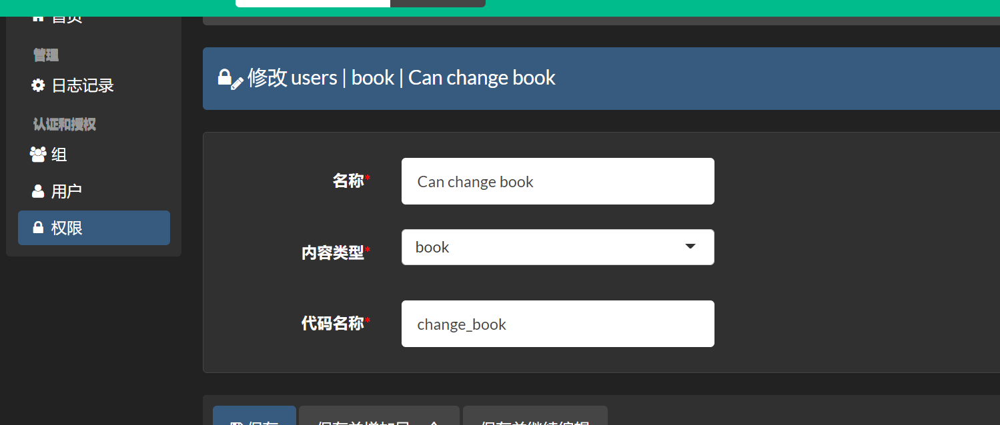

# 1. xadmin

```python
pip install django-import-export==1.1.0
pip install django-reversion==3.0.2
pip install https://github.com/nocmt/Xadmin1.11.x/archive/master.zip
```

## 1.1 setting

```python
INSTALL_APPS = [
    "xadmin",
    "crispy_forms",
    "reversion",
]
```

## 1.2 数据库迁移

xadmin拥有自己的数据库模型, 所以需要重新更新数据库模型

```python
python manage.py makemigrations
python manage.py migrate
```

## 1.3 路由

```python
# 注意需要首先注释掉默认的, admin接口
url(r"xadmin/", include(xadmin.site.urls))
```

## 1.4 使用站点

```python
# admin.py
import xadmin
from xadmin import views
from . import models


class BaseSetting(object):  # 注意这里继承object, 不需要继承admin.ModelAdmin
    """XAdmin的基本配置"""
    enable_themes = True  # 开启主体切换
    use_bootswatch = True


xadmin.site.register(views.BaseAdminView, BaseSetting)


class GlobalSettings(object):
    """xadmin的全局配置"""
    site_title = "管理系统"  # 设置站点标题
    site_footer = "xxx有限公司"  # 设置站点页脚
    menu_style = "accordtion"  # 设置菜单折叠


xadmin.site.register(views.CommAdminView, GlobalSettings)
```

## 1.5 创建超级用户

```python
python  manager.py createsuperuser
```

测试

```python
http://localhost:3000/xadmin/
```

