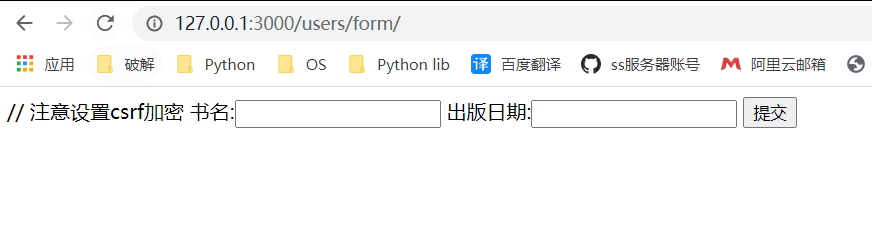
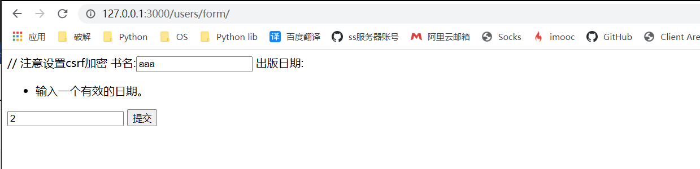

# 1. django模板

## 1.1 模板语言

## 1.2 模板配置

```python
TEMPLATES = [
    {
        "DIRS": [os.path.join(BASE_DIR, "template")],
    }
]
```

## 1.3 视图渲染

### 1.3.1 render

```Python
from django.shortcuts import render

def index(request):
    data = {"city": "上海"}
    return render(request, "index.html", data)
```

### 1.3.2 loader

```python
from django.http import HttpResponse
from django.template import loader

def index(request):
    # 获取模板
    template = loader.get_template("index.html")
    # 准备数据
    data = {"city": "北京"}
    # 模板渲染
    return HttpResponse(template.render(data))
```


# 2. 模板语言

## 2.1 基本语法

### 2.1.1 循环

支持list, tuple, dict等可迭代对象的遍历

```jinja2

	{{ forloop.counter }}  # 获取当前循环次数, 从1开始
	{{ book.descript }}  # 调用属性
	{{ book.content.1 }}  # 列表索引取值
  # 列表为空或不存在时执行此逻辑
	{{ do something }}

```

### 2.1.2 判断

```jinja2

	{{ do something1 }}

	{{ do something2 }}

	{{ do something3 }}

```

### 2.1.3 运算符

```jinja2
  # "=="两边不得有空格
```

条件判断连接符: `==`, `!=`, `>`, `>=`, `<=`, `and`, `or`, `not`

## 2.2 过滤器

| 参数      | 说明                                      |
| --------- | ----------------------------------------- |
| `safe`    | 禁用转义                                  |
| `length`  | 长度,  `{{ xxx | length: 2 }}`            |
| `default` | 默认值, `{{ data | default: "value" }}`   |
| `date`    | 时间, `{{ value | date: "Y-m-d H:i:s" }}` |
|           |                                           |
|           |                                           |
|           |                                           |
|           |                                           |
|           |                                           |

## 2.3 注释

* 单行注释

  ```jinja2
  {# xxx #}
  ```

* 多行注释

  ```jinja2
  
  	xxx
  
  ```

## 2.4 模板继承

* 父类中定义

  ```jinja2
  
  	do something1
  
  
  
  	do something2
  
  ```

  

* 子类中调用

  ```jinja2
  
  
  
  	需要修改的内容
  
  
  # 可以继承父类的block
  
  	{{ f_block.super }}
  
  ```

  
  
## 2.5 内部语法

| 代码               | 描述             |
| ------------------ | ---------------- |
| `` | `csrf_token`表单 |

  

# 3. 表单form模板

## 3.1 django自带模板

### 3.1.1 hellow word

先看一个hellow word

1. 构建`form`类

   ```python
   # file: forms.py
   from django import forms
   
   
   class BookForm(forms.Form):
       title = forms.CharField(label="书名", required=True, max_length=20)
       pub_date = forms.DateField(label="出版日期", required=True)
   ```

2. 视图函数调用

   ```python
   from django.shortcuts import render
   
   from users.forms import BookForm
   
   
   class ViewForm(View):
       form = BookForm
   
       def get(self, request):
           return render(request, "form.html", {"form": self.form})
   
       def post(self, request):
           self.form = self.form(request.POST)
           if self.form.is_valid():
               print(self.form.cleaned_data)
               return HttpResponse("OK!")
           else:
               return render(request, "form.html", {"form": self.form})
   ```

3. 路由配置

   ```python
   url("^form/$", views.ViewForm.as_view()),
   ```

4. `html`配置

   ```jinja2
   <form action="" method="post">
        // 注意设置csrf加密
       {{ form }}
       <input type="submit">
   </form>
   ```

5. 测试连接

   ```python
   http://127.0.0.1:3000/users/form/
   ```

   

   

## 3.2 借用ORM生成

### 3.2.1 helloword

1. 模型类编写

   ```python
   class Book(models.Model):
       title = models.CharField(max_length=10, null=False)
       pub_data = models.DateField()
   
       class Meta:
           db_table = "tb_book"
   ```

   

2. form模型类编写

   ```python
   class BookModelForm(forms.ModelForm):
       class Meta:
           model = Book
           fields = ["title", "pub_data"]
   ```

3. 视图函数(同3.1.1)

4. `url`配置(同3.1.1)

5. `html`配置(同3.1.1)

6. 测试链接(同3.1.1)


