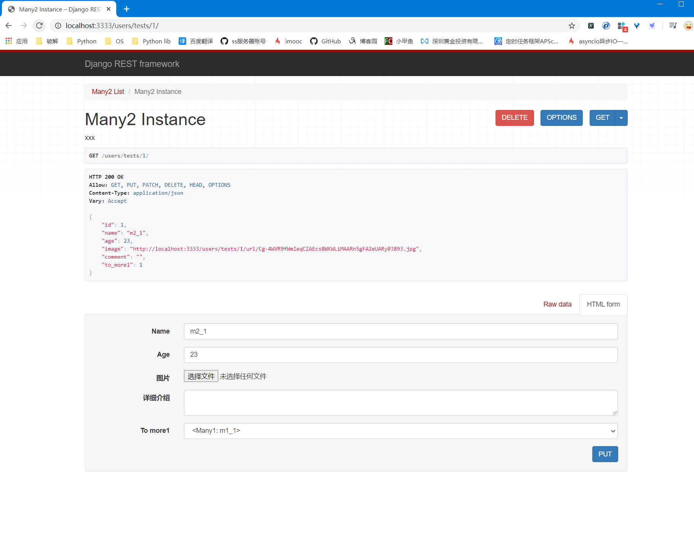
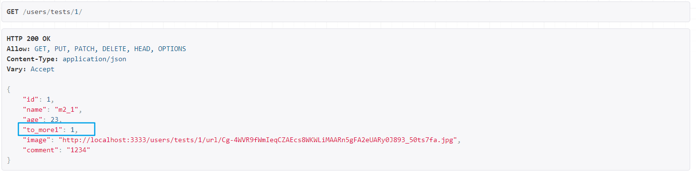
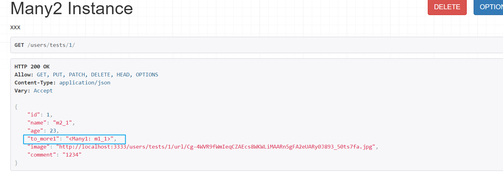
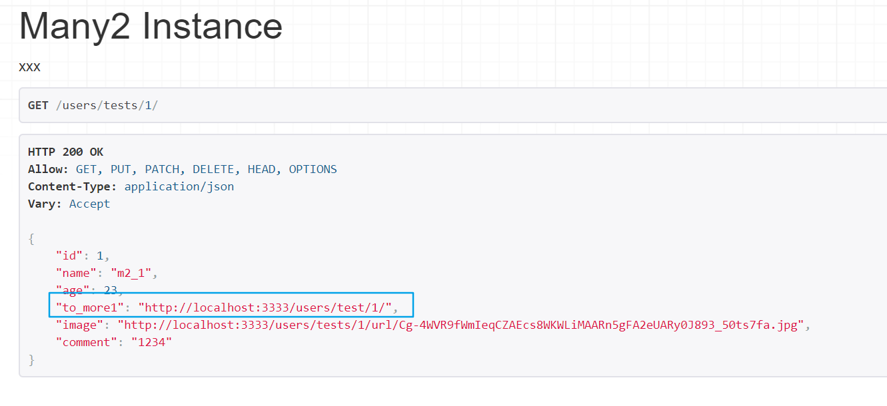
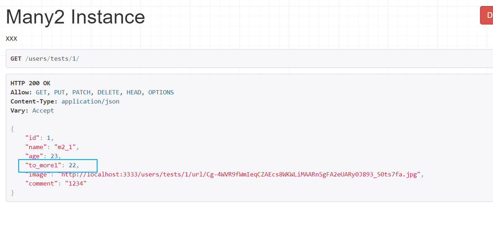
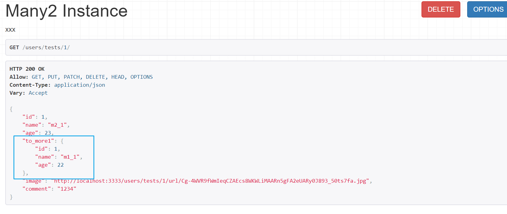
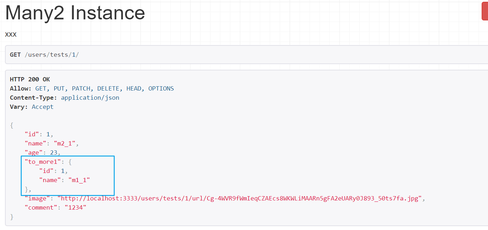

# 1. Django-REST-Framework

官网: `http://www.django-rest-framework.org/`

## 1.1 作用

用于处理序列化和反序列化, 数据库的增删改查等.

* `Serializer`不针对数据库的序列化, 适用于所有序列化与反序列的操作

## 1.2 安装

```python
pip install djangorestframework
```

## 1.3 依赖

* Python版本

  2.7/3.2/3.3/3.4/3.5/3.6/3.7...

* Django版本

  1.10/1.11/2.0...

# 2. 配置DRF

## 2.1 配置app

`setting.py`

```python
INSTALL_APP = [
    ...
    "rest_framework"
]
```

## 2.2 创建序列化器

`serializer.py`

```python
from rest_framework import serializers
# from rest_framework.serializers import ModelSerializer
from . import models


class Many1Serializer(serializers.Serializer):
    """Many2 序列化器"""
    id = serializers.IntegerField(label="ID", read_only=True)  # 只允许读取, 不允许写入数据库
    name = serializers.CharField(label="名称", max_length=20)  # 限制存入最大长度20
    age = serializers.IntegerField(label="年龄")

    class Meta:
        model = models.Many2
        fields = "__all__"
```

## 2.3 创建视图函数

`views.py`

```python
class Many2ViewSet(ModelViewSet):
    """xxx"""
    queryset = Many2.objects.all()

    serializer_class = Many1Serializer
```

## 2.4 配置路由

`urls.py`

```python
from . import views

router = DefaultRouter()
router.register(prefix=r"tests", viewset=views.Many2ViewSet)
urlpatterns += router.urls
```

## 2.5 访问接口



# 3. 序列化对象

## 3.1 Serializer

```python
def __init__(self, instance=None, data=empty, **kwargs):
return serializer
```

* instance:

  序列化对象

* data:

  反序列化数据

* context:

  REST内置可以储存变量的对象, 类似flask中的g变量

  * many: 

    instance为单个, 还是多个.

**示例**

```python
book = Books.objects.get(id=1)
ser = BookSerializer(instance=book)
ser.data   # 反序列化数据

books = Books.objects.all()
ser = BookSerializer(instance=books, many=True)
ser.data  # 反序列化数据
```

## 3.2 字段

| 字段                    | 字段构造方式                                                 |
| ----------------------- | ------------------------------------------------------------ |
| **BooleanField**        | BooleanField()                                               |
| **NullBooleanField**    | NullBooleanField()                                           |
| **CharField**           | CharField(max_length=None, min_length=None, allow_blank=False, trim_whitespace=True) |
| **EmailField**          | EmailField(max_length=None, min_length=None, allow_blank=False) |
| **RegexField**          | RegexField(regex, max_length=None, min_length=None, allow_blank=False) |
| **SlugField**           | SlugField(max*length=50, min_length=None, allow_blank=False) 正则字段，验证正则模式 [a-zA-Z0-9*-]+ |
| **URLField**            | URLField(max_length=200, min_length=None, allow_blank=False) |
| **UUIDField**           | UUIDField(format='hex_verbose') format: 1) `'hex_verbose'` 如`"5ce0e9a5-5ffa-654b-cee0-1238041fb31a"` 2） `'hex'` 如 `"5ce0e9a55ffa654bcee01238041fb31a"` 3）`'int'` - 如: `"123456789012312313134124512351145145114"` 4）`'urn'` 如: `"urn:uuid:5ce0e9a5-5ffa-654b-cee0-1238041fb31a"` |
| **IPAddressField**      | IPAddressField(protocol='both', unpack_ipv4=False, **options) |
| **IntegerField**        | IntegerField(max_value=None, min_value=None)                 |
| **FloatField**          | FloatField(max_value=None, min_value=None)                   |
| **DecimalField**        | DecimalField(max_digits, decimal_places, coerce_to_string=None, max_value=None, min_value=None) max_digits: 最多位数 decimal_palces: 小数点位置 |
| **DateTimeField**       | DateTimeField(format=api_settings.DATETIME_FORMAT, input_formats=None) |
| **DateField**           | DateField(format=api_settings.DATE_FORMAT, input_formats=None) |
| **TimeField**           | TimeField(format=api_settings.TIME_FORMAT, input_formats=None) |
| **DurationField**       | DurationField()                                              |
| **ChoiceField**         | ChoiceField(choices) choices与Django的用法相同               |
| **MultipleChoiceField** | MultipleChoiceField(choices)                                 |
| **FileField**           | FileField(max_length=None, allow_empty_file=False, use_url=UPLOADED_FILES_USE_URL) |
| **ImageField**          | ImageField(max_length=None, allow_empty_file=False, use_url=UPLOADED_FILES_USE_URL) |
| **ListField**           | ListField(child=, min_length=None, max_length=None)          |
| **DictField**           | DictField(child=)                                            |

## 3.3 字段限制

| 参数名称            | 作用                                          |
| ------------------- | --------------------------------------------- |
| **max_length**      | 最大长度                                      |
| **min_lenght**      | 最小长度                                      |
| **allow_blank**     | 是否允许为空                                  |
| **trim_whitespace** | 是否截断空白字符                              |
| **max_value**       | 最小值                                        |
| **min_value**       | 最大值                                        |
|                     |                                               |
| 下方参数为通用参数  | 下方参数为通用参数                            |
| **read_only**       | 表明该字段仅用于序列化输出，默认False         |
| **write_only**      | 表明该字段仅用于反序列化输入，默认False       |
| **required**        | 表明该字段在反序列化时必须输入，默认True      |
| **default**         | 反序列化时使用的默认值                        |
| **allow_null**      | 表明该字段是否允许传入None，默认False         |
| **validators**      | 该字段使用的验证器                            |
| **error_messages**  | 包含错误编号与错误信息的字典                  |
| **label**           | 用于HTML展示API页面时，显示的字段名称         |
| **help_text**       | 用于HTML展示API页面时，显示的字段帮助提示信息 |

# 4. 使用

## 4.1 序列化

### 4.1.1 常规序列化

```python
from . import serializer, models

m1 = models.Many1.objects.get(1)
ser = serializer.Many1Serializer(models.Many1, m1)
print(ser.data)
```

### 4.1.2 关联序列化

**注意**:

* 以下示例展示均为, 一对多序列化, 中的多向一序列化

* 如果需要一向多序列化, 需要在字段中增加`many=True`即可

  以下所有约束方法通用, 这里只演示`PrimaryKeyRelatedField`

  示例

  ```python
  to_more1 = serializers.PrimaryKeyRelatedField(label="关联many1主键", queryset=models.Many1.objects.all(), many=True)
  ```

  

#### 关联对象的主键

* 序列化器

  ```python
  class Many2Serializer(serializers.Serializer):
      """Many2 序列化器"""
      ...
      # to_more1 = serializers.PrimaryKeyRelatedField(label="关联many1主键", read_only=True)
  	to_more1 = serializers.PrimaryKeyRelatedField(label="关联many1主键", queryset=models.Many1.objects.all())  # 两者效果一样, 只是1中不能提交数据
  
      class Meta:
          model = models.Many2
          fields = "__all__"
  ```

* 数据展示

  

#### 关联对象的`__str__`

此操作返回的是ORM模型中的__str\_\_的结果

* 序列化器

  ```python
  class Many2Serializer(serializers.Serializer):
      """Many2 序列化器"""
  	...
      to_more1 = serializers.StringRelatedField(label="关联many1主键")
  
      class Meta:
          model = models.Many2
          fields = "__all__"
  ```

* 数据展示

  

#### 关联对象的url

* 序列化器

  ```python
  class Many2Serializer(serializers.Serializer):
      """Many2 序列化器"""
      ...
      to_more1 = serializers.HyperlinkedRelatedField(label="关联many1", read_only=True, view_name="abcdef:many1-detail")
  
      class Meta:
          model = models.Many2
          fields = "__all__"
  ```

  **注意**: 如果确定不了view_name是什么, 可以使用`django-extensions`来查看

  * pip install django-extensions
  * 安装app: `django_extensions`
  * 执行`python manage.py show_urls`, 获取对应视图函数的第三行即可

* 效果展示

  

#### 关联对象的指定字段

* 序列化器

  ```python
  class Many2Serializer(serializers.Serializer):
      """Many2 序列化器"""
      ...
      to_more1 = serializers.SlugRelatedField(label="关联many1", read_only=True, slug_field="age")
  
      class Meta:
          model = models.Many2
          fields = "__all__"
  ```

* 效果展示

  

#### 关联对象的序列化器

* 序列化器

  ```python
  class Many2Serializer(serializers.Serializer):
      """Many2 序列化器"""
      ...
      to_more1 = Many1Serializer()
  
      class Meta:
          model = models.Many2
          fields = "__all__"
  ```

  

* 效果展示

  

#### 自定义序列化信息

* 序列化器

  ```python
  class Many1RelateField(serializers.RelatedField):
      """自定义外键序列化信息"""
  
      def to_representation(self, value):
          # return 'Many1: %d %s %s' % (value.id, value.name, value.age)
          return {
              "id": value.id,
              "name": value.name
          }
      
      
  class Many2Serializer(serializers.Serializer):
      """Many2 序列化器"""
  	...
      to_more1 = Many1RelateField(read_only=True)
  
      class Meta:
          model = models.Many2
          fields = "__all__"
  ```

* 效果展示

  

## 4.2 反序列化

### 4.2.1 验证字段

验证顺序如下:

* `validate_` + 字段
* 验证器验证
* `validate(self, attrs)`

#### 4.2.1.1 单个字段

凡是格式为`validate_` + 字段, 全部会被验证调用

* 序列化器

  ```python
  class Many1Serializer(serializers.Serializer):
      """Many1 序列化器"""
      to_more2 = serializers.PrimaryKeyRelatedField(label="外键关联many2", read_only=True, many=True)
  
      class Meta:
          model = models.Many1
          fields = "__all__"
  
      @staticmethod
      def validate_name(value):
          """验证name字段"""
          if value == "test":
              raise TypeError("名称不能用test!")
          return value
  ```

  


#### 4.2.1.2 多个字段

使用`validate(self, attrs)`来处理多个字段验证

* 序列化器

  * 注意: 此函数必须返回`attrs`, 否则后续操作无法执行.

  ```python
  class Many1Serializer(serializers.Serializer):
      """Many1 序列化器"""
  	...
  
      def validate(self, attrs):
          """验证多个字段"""
          name = attrs.get("name", None)
          age = attrs.get("age", None)
          if not all([name, age]):
              raise ValueError("field not null!")
          if "test" in name:
              raise TypeError("名称test不可用!")
          if age < 20:
              raise TypeError("age必须大于20")
          return attrs
  ```

#### 4.2.1.3 验证器

自定义任意函数, 接受需要验证字段的数据.

```python
def validate(data):
    """验证age"""
    assert data > 20, "年龄必须大于20"  # 也可以使用raise抛出异常

class Many1Serializer(serializers.Serializer):
    """Many1 序列化器"""
	...
    age = serializers.IntegerField(label="年龄", validators=[validate])
```

也可使用自带的验证器:

* UniqueValidator

  字段唯一验证, 不能和数据库重复

* UniqueTogetherValidation

  字段唯一验证, 同时进行多个字段验证, 不能和数据库重复

  * 使用

    ```python
    class Many1Serializer(serializers.Serializer):
        """Many1 序列化器"""
    	...
        class Meta:
            validators = [
                UniqueTogetherValidation(
                    queryset=Many1.objects.all(),
                    fields=("first_floor_num", "second_floor_num")
                )
            ]
    ```


### 4.2.2 使用验证

```python
from . import serializer, models

data = {
    "name": "many2",
    "age": 22,
    ...
}

ser = serializer.Many1Serializer(data=m1)
ser.is_valid(raise_exception=False)   # 反序列化验证, 出错不抛出异常, 并在最后一起发送到client, True表示直接抛出异常, 并把异常发送到前端.
print(ser.data)  # 获取反序列化数据
```

* is_valid(raise_exception=False): Bool

  反序列化验证, raise_exception表示出现异常是否直接抛出, False表示不抛出, True表示直接抛出并返回给前端400 Bad Request异常

* error: dict/None

  进行验证后, 如果验证结果为False, 则可以通过此属性来获取失败原因

### 4.2.3 保存入库

注意在此操作之前, 一定要通过验证.

#### 4.2.3.1 保存

注意:

	* 此函数一定要返回创建后的对象

```python
class Many1Serializer(serializers.Serializer):
    """Many1 序列化器"""
    ...
    def create(self, validate_data):
        """新增数据"""
        m_obj = models.Many1(**validated_data)
        m_obj.save()
        return m_obj

```

**调用**

```python
data = {
    "name": "many1_1",
    "age": 23
}
ser = BookSerializer(data=data)
ser.is_valid()  # 必须先进行验证操作, 才能进行修改
ser.save()   # 将修改的数据存储到数据库
ser.validated_data  # 获取反序列化后的数据
```


#### 4.2.3.2 更新

注意:

	* 一定要返回instance

```python
class Many1Serializer(serializers.Serializer):
    """Many1 序列化器"""
    ...
    def update(self, instance, validated_data):
        """更新数据"""
        for key, value in validated_data.items():
            setattr(instance, key, value)
        return instance
```

**调用**

```python
m1_obj = Many1.object.get(id=1)
data = {
    "name": "many1_1",
    "age": 23
}
ser = Many1Serializer(m1_obj, data=data, partial=True)
ser.is_valid()  # 必须先进行验证操作, 才能进行修改
ser.save()   # 将修改的数据存储到数据库
ser.validated_data  # 获取反序列化后的数据
# <object: {
#     "name": "many1_1",
#     "age": 22
# }>
```

**注意**:

* 默认data必须传递全部参数, 否则会因找不到对应的参数而抛出异常
* 可以通过`partial=True`来更新部分参数

#### 4.2.3.3 参数传递

不进行验证, 但是还需要增加反序列化参数

```python
data = {
    "name": "many1_1",
    "age": 23
}
ser = BookSerializer(data=data)
ser.is_valid()  # 必须先进行验证操作, 才能进行修改
ser.save(name1="aaa", name2="bbb")   # 将修改的数据存储到数据库
ser.validated_data  # 获取反序列化后的数据
# <object: {
#     "name": "many1_1",
#     "name1": "aaa",
#     "name2": "bbb",
#     "age": 22
# }>
```

# 5. django-model-rest

上述很多功能, 在DRF的`ModelSerializer`中已经存在, 我们可以直接进行使用

* 此类为`Serializer`的拓展类, 所以`Serializer`的全部属性都支持调用	

## 5.1 Meta

```python
from rest_framework import serializers
# from rest_framework.serializers import ModelSerializer
from . import models


class Many1Serializer(serializers.ModelSerializer):
    """Many1 序列化器"""

    class Meta:
        model = models.Many1
        fields = "__all__"


class Many2Serializer(serializers.ModelSerializer):
    """Many2 序列化器"""
    # 也可以在这里指明关联序列化器
    # to_more1 = Many1Serializer()

    class Meta:
        model = models.Many2
        fields = "__all__"
        depth = 1
        extra_kwargs = {
            "name": {"max_length": 20, "required": False}
        }
```

Meta类属性说明:

* model: 

  object, 指定需要序列化的ORM模型

* fields:

  str/list/tuple, 指定需要序列化的字段

* exclude:

  str/list/tuple, 指定不需要序列化的字段

* depth:

  int, 指定关联表, 序列化的深度

* read_only_fields:

  str/list/tuple, 指定只读字段(禁止写入数据)

* extra_kwargs:

  dict, 给字段添加缺省参数


## 5.2 get

如果序列化器中定义了`get_字段`的方法, 序列化时, 将会取用`get_字段`所产生的返回值

 ```python
# 注意此时需要使用SerializerMethodField
class Many1Serializer(serializers.Serializer):
    """Many1 序列化器"""
    name = serializers.SerializerMethodField(label="名称", max_length=20)
    
    def get_name(self, obj):
		if obj.name == "1":
            return 1
        else:
            return 2
 ```


