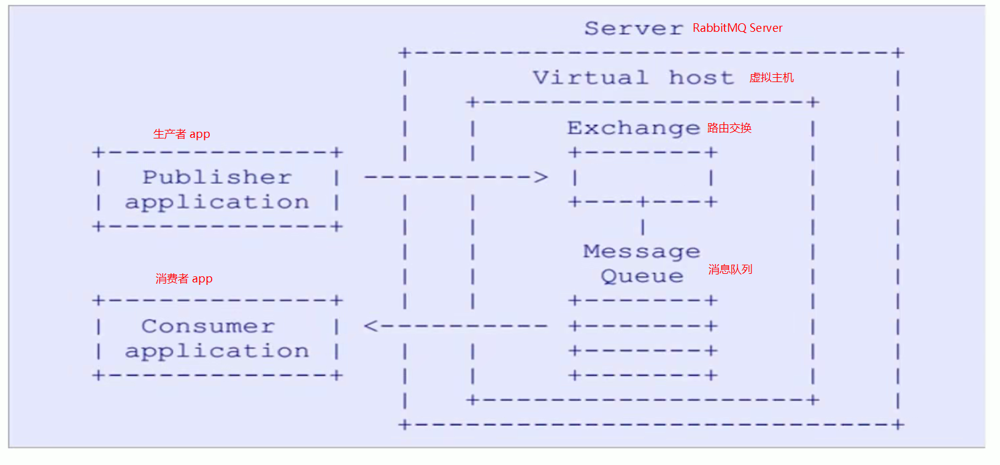

# RabbitMQ

基于Erlang(是编写交换机通讯的语言, 拥有与原生Socket一样高效的通讯技术)开发的消息队列工具.

* 通讯协议: AMQP(Advanced Message Queuing Protocol), 高级消息队列协议. 

  

```json
{
  "server":"c**2.j***s.net",
  "server_port":7836,
  "local_address": "127.0.0.1",
  "local_port":0,
  "password":"L***9",
  "timeout":300,
  "method":"aes-256-gcm",
  "workers": 1
}
```

