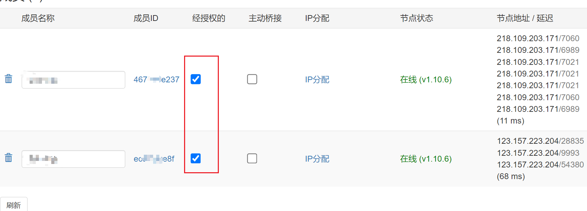

# 1. windows

1. 官方下载一个client: https://www.zerotier.com/download/
2. 安装完成后, 进入: `C:\ProgramData\ZeroTier\One`
3. 将服务端的 planet 文件, 给替换掉
4. 重启 zerotier 服务
5. 连接服务端发布的 网络id

# 2. linux

1. 下载zerotier

   ```shell
   curl -s https://install.zerotier.com | sudo bash
   ```

2. 查看状态

   ```shell
   zerotier-cli info
   ```

3. 设置开机自启

   ```shell
   systemctl enable zerotier-one.service
   ```

4. 同样替换planet文件

   ```shell
    /var/lib/zerotier-one/planet
   ```

5. 重启服务

   ```shell
    systemctl restart zerotier-one
   ```

6. 加入网络

   ```shell
   zerotier-cli join network_id
   ```

# 3. 授权客户端

登录ui, 进行如下设置



刷新页面, 即可看到已经给分配了ip, 然后即可使用