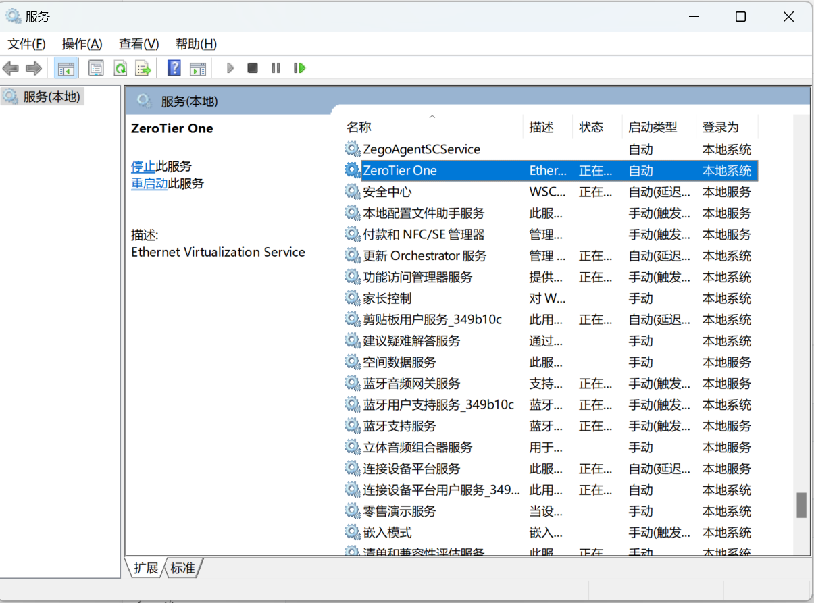

# 1. windows

1. 官方下载一个client: https://www.zerotier.com/download/

2. 安装完成后, 进入: `C:\ProgramData\ZeroTier\One`

3. 将服务端的 planet 文件(专用文件), 给替换掉

4. 重启 zerotier 服务

   

5. **管理权限**连接服务端发布的 网络id

   ```
   zerotier-cli join <network_id>
   ```

# 2. linux

1. 下载zerotier

   ```shell
   curl -s https://install.zerotier.com | sudo bash
   ```

2. 查看状态

   ```shell
   zerotier-cli info
   ```

3. 设置开机自启

   ```shell
   systemctl enable zerotier-one.service
   ```

4. 同样替换planet文件(专用文件)

   ```shell
    cp ./planet /var/lib/zerotier-one/planet
   ```

5. 重启服务

   ```shell
    systemctl restart zerotier-one
   ```

6. 加入网络

   ```shell
   zerotier-cli join <network_id>
   zerotier-cli leave <network_id>  # 删除网络, 重新添加时, 需要执行此操作, 防止网卡不生效
   ```

# 3. Android

下载链接: https://github.com/kaaass/ZerotierFix/releases/tag/1.0.9

和上面类似, 直接看看就会


# 4. 授权客户端

登录ui, 进行如下设置


刷新页面, 即可看到已经给分配了ip, 然后即可使用
