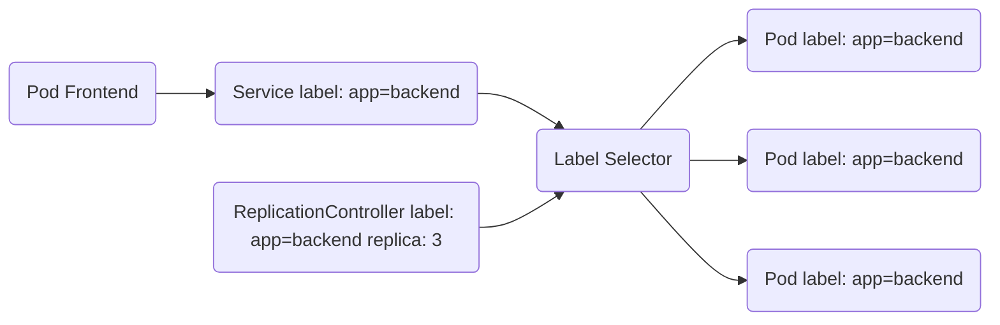

# 1. Kubernets

#### 1.1 Master

用来管理和控制整个集群的各节点. 包含如下服务:

* Kubernetes API Server(kube-apiserver): 提供HTTP Rest接口的关键服务进程, 用来对资源进行CRUD的唯一入口, 也是集群的控制入口进程.
* kubernetes Controller Manager(kube-controller-manager): 提供资源对象的自动化控制中心.
* Kubernetes Scheduler(kube-scheduler): 负责资源调度(Pod)的进程.

#### 1.2 Node

除了Master节点, 其他节点都被称为Node节点, 可以是物理机, ECS, 虚拟机的等. 包含如下服务:

* kubelet: 负责Pod的创建, 启停等任务, 并且与Master协作, 实现集群管理功能. (新节点的注册等)
* kube-proxy: 实现Service的通信与负载均衡的重要组建
* Docker Engine(docker): 负责容器创建和管理工作.

#### 1. 3 Pod

Pod是由Pause和多个业务container构成的资源组.

动态Pod: 可以被Master调度到任意Node上部署, 启动.

静态Pod: 固定在某个Node节点上部署, 启动

#### 1.4 Label

labe是用来标记资源的键值对, 通常可以被附加到: Node, Pod, Service, RC等上面, 来标记任意数量的资源对象上.

方便使用Selector来筛选这些标记的Lables.

#### 1.5 Replication Controller

期望控制, 简称RC, 用来:

* 标记Pod期望的副本数量, 用来控制Pod的创建及副本的自动控制(扩容或者缩容)

* 定义完整的Pod模板.

* 通过Label Selector机制实现对标记需要控制的Pod副本, 标记语法:

  ```yaml
  spec:
    selector:
      app: mysql
      tier: frontend
  ```

* 改变Pod镜像版本, 实现Pod的滚动升级.

Replica set, 是对RC的一次升级, 标记语法筛选器存在一定的差异:

```yaml
spec:
  selector:
    matchLabels:
      app: mysql
    matchExpressions:
      - {key: tier, operator: In, values: [frontend]}
```

#### 1.6 Deployment

类似RC, 但是做了很大的升级, 差别如下

* 可以实时查看Pod部署进度.
* 标记语法直接引用Replica set, 此时用命令查看可以获得以Pod命名的RS

示例配置

```yaml
apiVersion: extensions/v1beta1
kind: Deployment
metadata: 
  name: mysql
spec:
  replacas: 1
  selector:
    metachLabels:
      x: x1
    matchExpressions:
      - {key: x, operator: In, values: [x1]}
  template:
    metadata:
      labels:
        app: mysql
        x: x1
      spec:
        containers:
          - name: mysql
            image: mysql
            imagePullPolicy: IfNotPresent
            ports:
              - containerPort: 3306
```

#### 1.7 Horizantal Pod Autoscaler

Pod横向自动扩容, 简称HPA, 自动触发水平扩容或者缩容.

与RC, Deployment一样, 也是属于Kubernetes资源管理对象. 通过追踪分析RC控制的所有目标Pod的负载变化情况, 来针对性的调整副本数量. 衡量指标:

* CPU Utilization Percentage. 目标Pod中的所有副本自身CPU利用率的平均值.
* 应用程序自定义的度量指标, 比如QPS, TPS.


示例配置文件

```yaml
apiVersion: autoscaling/v1
kind: HorizontalPodAutoscaler
metadata:
  name: mysql
  namespace: default
spec:
  maxReplicas: 10     # 扩容范围 1 ~ 10
  minReplicas: 1
  scaleTargetRef:
    kind: Deployment
    name: mysql
  targetCPUUtilizationRercentage: 90   # 副本cpu平均值高于90%开始扩容
```

#### 1.8 StatefulSet

为了支持有状态的服务, 引用了Statefulset, 此时相当于RC/Deployment的一个变种, 具有一下特性:

* 每个Pod都有唯一且稳定的网络标识, 用于集群成员发现其他成员服务, 这些Pod采用DNS通讯而不是Cluster IP通讯, 域名格式为:

  ```shell
  $(podname).$(headless service name)
  ```

* Pod的启停顺序是受控的, 操作n个服务时, 前n-1个服务必须已经完成.

* Pod采用稳定的持久化存储, 通过PV或者PVC实现, 删除Pod默认不会删除存储卷数据.

#### 1.9 Service

就是我们常说的一个微服务. 



特点:

* 服务发现机制: Env, DNS
* 外部访问Service, 需要将Cluster Port给映射到Node上.

示例配置文件

```yaml
apiVersion: v1
kind: Service
metadata:
  name: tomcat
spec:
  type: NodePort          # 直接暴露模式, LoadBalancer表示负载均衡的高可用模式
  ports:
    - port: 8080
      name: service-port
      targetPort: 8080    # 暴露给容器的其他服务的端口, 默认等于port
      nodePort: 31002     # 将端口映射到node节点上, 让外部可以访问
    - port: 8005
      name: shutdown-port
  selector:
    tier: frontend
```

#### 1. 10 Job

用于批处理任务的处理工作. 类似RC, Deployment, RS, DaemonSet, 也会启动一组Pod容器. 差别在于:

* Job控制的Pod副本是临时运行的, 运行完成Pod就被回收了.
* Job的Pod运行模式是并行模式.

#### 1.11 Volume

Pod中能够被多个容器访问的共享目录. Volume是基于Pod而虚拟化出来的文件系统, 生命周期依赖于Pod, 而不是容器. 磁盘挂载类型分为:

* emptyDir: 在Node创建时, 就创建出来的临时文件, 生命周期跟随当前的Pod, 可以被其他程序所使用
* HostPath: 挂载本地文件, 作为数据永久保存.
* gcePersistentDisk/awsElasticBlockStore: 云服务商提供的云磁盘, 数据永久保存.
* NFS: 网络文件存储系统
* 其他挂载: iscsi/flocker/glusterfs/rbd/gitRepo/secret

示例配置文件

```yaml
spec:
  volumes:
    - name: datavol
      emptyDir: {}
    - name: storage
      hostPath:
        path: /data   # 挂载本地磁盘位置
  container:
    - name: tomcat-demo
      image: tomcat
      volumeMounts:
        - moutPath: /mydata-data
          name: datavol
      imagePullPolicy: IfNotPresent
```

#### 1.12 Persistent Volume

简称PV, 与Volume类似, 属于计算资源的一部分, 特点如下:

* PV只能是网络存储, 不属于Node节点, 但是可以在每个Node上访问
* PV不是被定义Pod上的, 独立与Pod之外.
* PV支持的网络类型包括: NFS, GCE, EBS等等.

PV状态:

* Available: 空闲
* Bound: 已经绑定到某个PVC上
* Released: PVC已被删除, 但资源未被集群回收
* Failed: PV自动回收失败

示例配置文件:

```yaml
apiVersion: v1
kind: PersistentVolume  # 引用已经存在的PV, PersistentVolumeClaim 直接申请PV
metadata:
  name: pv0003
spec:
  capacity:
    storage: 5Gi
  accessModes:
    - ReadWriteOnce  # 读写权限(只能单个Node挂载), ReadOnlyMany(只读, 多个Node挂载), ReadWriteMany(读写, 多个Node挂载)
  nfs:
    path: /somepath
    server: localhost
```

#### 1.13 Namespace

命名空间, 用来实现资源隔离的重要策略. Kubernetes集群启动后会自动创建一个default的Namespance. 默认Pod, RC, Service都将被创建到此环境中.

示例配置文件

```yaml
apiVersion: v1
kind: Namespace
metadata:
  name: development
  # 使用时, 直接在这里使用: namespace: development即可
```

#### 1.14 Annotation

注解, 也是和label类似使用key, value形式来定义的. 主要用于:

* 信息存储: build, release, docker镜像等
* 日志库, 监控库, 分析库等资源库的地址信息
* 调试工具信息
* 团队信息等

#### 1.15 ConfigMap

docker配置修改方式:

* 登录container, 修改配置, 重启container内部服务
* 运行时, 通过环境变量来传递参数
* 通过Docker Volume将容器外的配置文件映射到容器内部

缺点很明显, 在分布式下, 多节点操作极为繁琐, 所以k8s的解决方式是:

* 将配置项全部key, value化
* 存储在Etcd数据库中, 然后提供API允许k8s主键访问
* 然后etcd中的ConfigMap通过Volume映射的方式, 直接转换成目标Pod内的配置文件, 实现分布式同步.