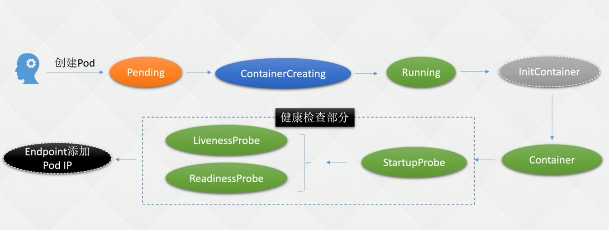
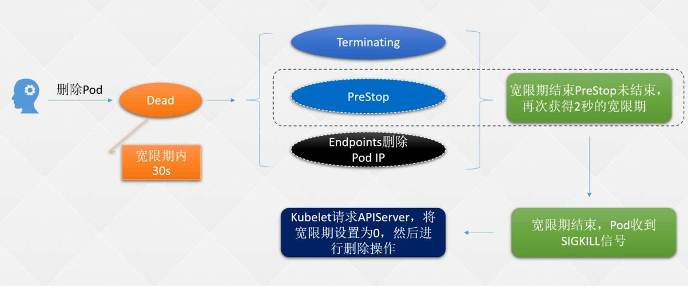

# 1. Pod

## 1.1 简介

* 简介
  * 一组(多个容器)构成, 并且包含一个Pause容器
  * Pause容器是Pod的父容器, 用于僵尸进程回收, 保证容器存储, 网络, PID, IPC等资源的共享. 相当于把多个容器给合并到一个容器的工具, 比如用localhost:port去访问另一个container资源, 而不是ip+port

* 用途
  * 解决 强依赖的服务需要部署在一起
  * 解决 多个服务协同工作
  * 兼容其他CRI标准的运行

## 1.2 Pod操作

### 1.2.1 创建

* 命令

  ```shell
  kubectl create -f pod.yaml
  ```

* 图解

  

### 1.2.2 删除

* 命令

  ```shell
  kubectl delete -f pod.yaml
  ```

* 图解

  

### 1.2.3 查看

* 常见命令

  ```shell
  kubectl get pod -o wide
  ```

# 2. yaml参数

* 基本构造

  ```yaml
  apiVersion: v1
  kind: Pod
  metadata:
    name: nginx
  spec:
    containers:
      - image: nginx
        name: nginx
  ```

* 参数解析

  | 参数                      | 是否必选 | 格式      | 说明          |
  | ------------------------- | -------- | --------- | ------------- |
  | apiVersion                | 是       | v1/v2..   | API 的版本号  |
  | kind                      | 是       | Pod       | 类型          |
  | [metadata](#2.1 metadata) | 是       | key-value | 元数据        |
  | [spec](#2.2 spec)         | 是       | key-value | Pod的详细定义 |


## 2.1 metadata

| 参数 | 是否必选 | 格式 | 说明                          |
| ---- | -------- | ---- | ----------------------------- |
| name | 是       | str  | 符合 RFC 1035 规范的 Pod 名称 |
|      |          |      |                               |

## 2.2 spec

| 参数                            | 是否必选 | 格式    | 说明                                                         |
| ------------------------------- | -------- | ------- | ------------------------------------------------------------ |
| [containers](#2.2.1 containers) | 是       | list    | 符合 RFC 1035 规范的 Pod 名称                                |
| restartPolicy                   | 否       | 指定str | 指定容器的重启策略<br />Always: 自动重启, 默认值<br />OnFailure: 如果退出码不是0, 则自动重启<br />Never: 不重启 |

### 2.2.1 containers

| 参数                          | 是否必选 | 格式      | 说明                                                         |
| ----------------------------- | -------- | --------- | ------------------------------------------------------------ |
| imagePullPolicy               | 否       | 指定的str | 指定镜像的拉取策略, 目前支持的格式如下:<br />Always: 总是拉取, 不指定镜像版本的默认值<br />IfNotPresent: 镜像不存在时候, 进行拉取<br />Never: 不管是否存在, 都不会拉取, 指定进项版本的默认值 |
| command                       | 否       | list      | 容器启动执行的命令                                           |
| [健康检查](#1. 健康检查)      | 否       | dict      | 健康检查                                                     |
| [lifecycle](#2. 生命周期钩子) | 否       | dict      | 启动/删除钩子配置                                            |

#### 1. 健康检查

* 探针的种类

    | 参数           | 是否必选 | 格式 | 说明                                                         |
    | -------------- | -------- | ---- | ------------------------------------------------------------ |
    | startupProbe   | 否       | dict | 探测容器是否启动, 优先执行本探测机制. 在程序的每次启动后检测到成功, 则不再执行本探针 |
    | livenessProbe  | 否       | dict | 探测容器是否运行, 探测失败则强杀.(一直执行)                  |
    | readinessProbe | 否       | dict | 探测容器内部程序是否正常, 用于判断容器是否Ready.(一直执行)   |

* 探针实现方式

  | 参数      | 是否必选 | 格式 | 说明                                     |
  | --------- | -------- | ---- | ---------------------------------------- |
  | exec      | 否       | dict | 容器类执行命令, 退出码为0, 为正常        |
  | tcpSocket | 否       | dict | TCP检查端口监听状态                      |
  | httpGet   | 否       | dict | HTTP的GET请求, Code码在200~400之间为正常 |
  | grpc      | 否       | dict | GRPC协议请求探测, 需要k8s>1.24版本       |

* 示例

  ```yaml
  apiVersion: v1
  kind: Pod
  metadata:
    name: nginx
  spec:
    containers:
      - image: nginx
        name: nginx
        command: # 可选，容器启动执行的命令
          - sh
          - -c
          - sleep 30; nginx -g "daemon off;"
        startupProbe:
          tcpSocket: # 端口检测方式
            port: 80
          initialDelaySeconds: 10 # 初始化时间
          timeoutSeconds: 2 # 超时时间
          periodSeconds: 8 # 检测间隔
          successThreshold: 1 # 检查成功为 2 次表示就绪
          failureThreshold: 20 # 检测失败 1 次表示未就绪
        readinessProbe:
          #grpc: # 接口检测方式
          #  port: 2379
          httpGet: # 接口检测方式
            path: /index.html # 检查路径
            port: 80
            scheme: HTTP # HTTP or HTTPS
            #httpHeaders: # 可选, 检查的请求头
              #- name: end-user
              # value: Jason
          initialDelaySeconds: 10 # 初始化时间, 健康检查延迟执行时间
          timeoutSeconds: 2 # 超时时间
          periodSeconds: 5 # 检测间隔
          successThreshold: 1 # 检查成功为 2 次表示就绪
          failureThreshold: 2 # 检测失败 1 次表示未就绪
        livenessProbe: # 可选，健康检查
          httpGet: # 接口检测方式
            path: /index.html # 检查路径
            port: 80
            scheme: HTTP # HTTP or HTTPS
          #tcpSocket: # 端口检测方式
          #  port: 80
          initialDelaySeconds: 10 # 初始化时间
          timeoutSeconds: 2 # 超时时间
          periodSeconds: 5 # 检测间隔
          successThreshold: 1 # 检查成功为 2 次表示就绪
          failureThreshold: 2 # 检测失败 1 次表示未就绪
  ```

#### 2. 生命周期钩子

| 参数      | 是否必选 | 格式 | 说明                                                         |
| --------- | -------- | ---- | ------------------------------------------------------------ |
| postStart | 否       | dict | 容器创建完成后, 需要执行的操作, 注意: 此参数和command可能同时执行, 所以spec.containers[].command命令, 不能依赖于postStart |
| preStop   | 否       | dict | 容器删除时, 需要优先执行的操作                               |

* 示例

  ```yaml
  spec:
    containers:
      - image: registry.cn-beijing.aliyuncs.com/dotbalo/nginx:1.15.12-alpine
        name: nginx
        imagePullPolicy: IfNotPresent
        command: # 可选，容器启动执行的命令
          - sh
          - -c
          - nginx -g "daemon off;"
        lifecycle:
          preStop:
            exec:
              command:
                - sh
                - -c
                - sleep 10
          postStart:
            exec:
              command:
                - sh
                - -c
                - mkdir -p /data/postStart
  ```

# 3. 测试

## 3.1 用例

* 定义文件

  ```yaml
  apiVersion: v1  # 版本号
  kind: Pod  # 资源类型
  metadata:  # 元数据
    labels: # 标签
      run: nginx
    name: nginx # Pod名称
  spec: # Pod定义
    containers:  # 容器组定义
      - image: nginx:1.15.12 # 指定容器的镜像, 可以重复
        name: nginx # 指定容器名称, 不可以重复
        ports: # 可选，容器需要暴露的端口号列表
          - containerPort: 80
        imagePullPolicy: IfNotPresent
        # command: [ "sleep", "10" ]  # 类似docker entrypoint, 覆盖运行命令
        # args: [] # 参考docker args
  ```

* 创建pod

  ```shell
  kubectl create -f pod.yaml  # 创建
  kubectl delete -f pod.yaml  # 删除
  curl ip:80 # 测试访问
  ```

## 3.3 故障排查

| 状态                               | 说明                                                         |
| ---------------------------------- | ------------------------------------------------------------ |
| Pending（挂起）                    | Pod 已被 Kubernetes 系统接收，但仍有一个或多个容器未被创建，可以通过kubectl describe 查看处于 Pending 状态的原因 |
| Running（运行中）                  | Pod 已经被绑定到一个节点上，并且所有的容器都已经被创建，而且至少有一个是运行状态，或者是正在启动或者重启，可以通过 kubectl logs 查看 Pod 的日志 |
| Succeeded（成功）                  | 所有容器执行成功并终止，并且不会再次重启，可以通过 kubectl logs 查看 Pod日志 |
| Failed（失败）                     | 所有容器都已终止，并且至少有一个容器以失败的方式终止，也就是说这个容器要么以非零状态退出，要么被系统终止，可以通过 logs 和 describe 查看 Pod 日志和状态 |
| Unknown（未知）                    | 通常是由于通信问题造成的无法获得 Pod 的状态                  |
| ImagePullBackOff<br />ErrImagePull | 镜像拉取失败，一般是由于镜像不存在、网络不通或者需要登录认证引起的，可以使用 describe 命令查看具体原因 |
| CrashLoopBackOff                   | 容器启动失败，可以通过 logs 命令查看具体原因，一般为启动命令不正确，健康检查不通过等 |
| OOMKilled                          | 容器内存溢出，一般是容器的内存 Limit 设置的过小，或者程序本身有内存溢出，可以通过 logs 查看程序启动日志 |
| Terminating                        | Pod 正在被删除，可以通过 describe 查看状态                   |
| SysctlForbidden                    | Pod 自定义了内核配置，但 kubelet 没有添加内核配置或配置的内核参数不支持，可以通过 describe 查看具体原因 |
| Completed                          | 容器内部主进程退出，一般计划任务执行结束会显示该状态，此时可以通过 logs查看容器日志 |
| ContainerCreating                  | Pod 正在创建，一般为正在下载镜像，或者有配置不当的地方，可以通过 describe查看具体原因 |

注意: Pod 的 Phase 字段只有 Pending、Running、Succeeded、Failed、Unknown，其余的为处 于上述状态的原因，可以通过 `kubectl get po xxx –o yaml`查看。
