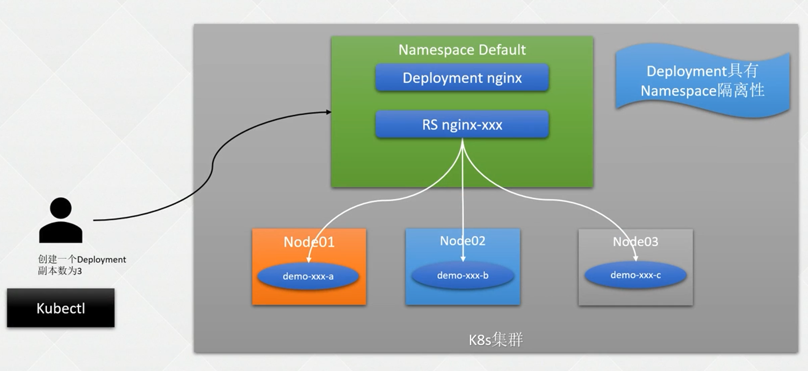

# 1. Deployment

## 1.1 简介

* 无状态服务管理
* 支持无缝迁移, 自动扩缩容, 自动容灾恢复, 一键回滚

* 支持Java, Go, Vue, PHP等业务, 一起其他需要任何状态的服务
* 具有namespace隔离性

## 1.2 创建

* 部署过程

  

* 生成模板

  ```shell
  kubectl create deployment nginx --image=nginx --replicas=3 -oyaml --dry-run=client > deployment.yaml
  ```

* 创建

  ```shell
  # 模板修改完成后
  kubectl create -f deployment.yaml
  
  # 查看部署进度
  kubectl rollout status deployment nginx-deployment
  
  # 参看生成的pod
  kubectl get pod -owide
  
  # 尝试删除一个pod
  kubectl delete pod nginx-deployment-85b98978db-j2mjn
  # 再次查看, 是否恢复
  kubectl get pod -owide
  ```

* 删除

  ```shell
  # 直接删除
  kubectl delete deploy nginx-deployment
  
  # 指定启动文件删除
  kubectl delete -f deployment.yaml
  ```

* 平滑更新

  ```shell
  # 仅支持spec.template.spec下面的数据修改, 才能触发更新
  # 调整副本数量
  kubectl scale deployment nginx-deployment --replicas=3
  
  # 编辑本地yaml文件, 并同步到集群
  kubectl apply/replace -f deployment.yaml
  # 如果本地文件不是最新的, 可以直接导入, 然后编辑生效
  kubectl get deploy nginx-deployment -oyaml
  
  # 直接编辑k8s集群文件, 保存即生效
  kubectl edit deploy nginx-deployment
  
  # 直接修改, 修改即生效
  kubectl set image deployment nginx-deployment nginx=nginx:1.9.1 --record
  kubectl set resources deployment nginx-deployment -c=nginx --limits=cpu=200m,memory=512Mi
  ```

* 回滚

  ```shell
  # 查看版本
  kubectl rollout history deployment
  kubectl rollout history deployment nginx-deployment --revision=2
  
  # 临时暂停Pod检测, 使用kubectl set xx时, 保证多次set不触发更新
  kubectl rollout pause deployment nginx-deployment
  kubectl rollout resume deployment nginx-deployment
  
  # 回滚指定版本
  kubectl rollout undo deployment nginx-deployment --to-revision=2
  ```

# 2. yaml语法

* 基本模板

  ```yaml
  apiVersion: apps/v1  # 只能用apps/v1
  kind: Deployment
  metadata:
    name: nginx-deployment  # deployment名称
    labels:  # deployment的标签名
      app: nginx
  spec:
    replicas: 3
    selector:
      matchLabels:
        app: nginx  # 指定使用的标签, 与spec.template.metadata.labels对应的
    template:  # deployment 创建Pod的模板
      metadata:
        labels:
          app: nginx  # 该组模板的标签名
      spec:  #容器信息
        containers:
          - name: nginx
            image: nginx
            ports:
              - containerPort: 80
  ```

## 2.1 参数

* spec.revisionHistoryLimit

  指定历史版本限制的记录, 默认是10个, 指定为0时, 表示不保存

* spec.minReadySeconds

  新创建的Pod, 如果没有崩溃, 则认定其可用时间, 默认是0s.立即可用

* spec.strategy.type

  * Recreate: 先删除旧的Pod, 再重新生成新的Pod
  * RollingUpdate: 滚动更新
    * spec.strategy.rollingUpdate.maxUnavailable: 保证最大不可用Pod值, 默认是25%, 可以设置数字. 如果maxSurge为0, 则此处不能为0
    * spec.strategy.rollingUpdate.maxSurge: 允许超过期望数的最大值. 默认是25%, 可以设置数字. 如果maxUnavailable为0, 则此处不能为0