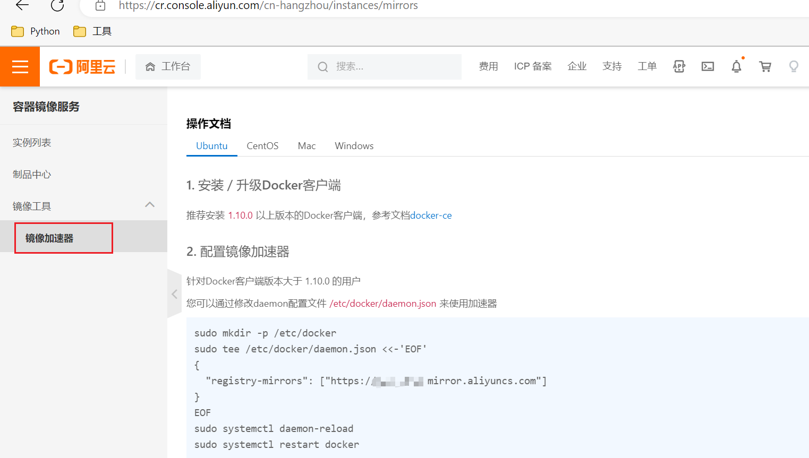

# 1. image

```bash
docker image [选项] [ID/镜像名[:版本号]]
```

* pull: 下载镜像
* push: 上传镜像, 需要先登录`docker login`
* load: 本地载入镜像, tar包
* save: 导出镜像到本地, tar包
* rm:  删除进项, 可以简写为`docker rmi ID/镜像`
* ls: 列出全部镜像
* build: 使用dockerfile文件自动化制作image

## 1.1 镜像下载

完整镜像源地址通常包含四个部分

```shell
docker.io/library/nginx:latest
```

* 镜像地址registry: `docker.io`/`registry.cn-hangzhou.aliyuncs.com`...
* 仓库地址repository: `library`/`google_containers`...
* 镜像名称name: `nginx`/`centos`..
* 版本号version: `latest`/`1.20`...

### 1.1.1 官方拉取

```bash
docker image pull [docker.io/]centos
```

### 1.1.2 国内源拉取

#### 1.1.2.1 直接指定下载

```bash
docker image pull hub.c.163.com/library/nginx
```

#### 1.1.2.2 全局配置代理加速

需要到对应平台找到对应的url, 例如:

* 阿里: https://cr.console.aliyun.com
* 网易: https://c.163.com/hub#/m/home/

去生成对应的url, 例如:



然后修改或者增加docker配置: `/etc/docker/daemon.json`

```bash
{
"registry-mirrors": ["https://xxx.mirror.aliyuncs.com"]
}

```

最后重启docker

```bash
[root@localhost repos]# systemctl daemon-reload
[root@localhost repos]# systemctl restart docker
[root@localhost repos]# docker pull ubuntu
```

## 1.2 镜像上传

### 1.2.1 docker账号注册

### 1.2.2 上传镜像

1. docker 登录

   ```bash
   docker login -u username -p password -e "hp***@gmail.com"
   ```

2. 上传镜像

   ```bash
   docker push image
   ```

3. 下载上传的镜像

   ```bash
   docker pull username/image
   ```

   

## 1.3 载入本地镜像

```bash
docker image load -i /root/docker.io-centos.tar
```

* -i: 载入指定镜像归档文件

# 2. 镜像制作

主要用于镜像制作

## 2.1 container生成镜像

### 2.1.1 参数详解

```bash
docker commit [选项] ID/image
```

* -m: 备注消息

### 2.1.2 实例

```bash
docker container run -it -d centos:tree /bin/bash  # 生成container
docker commit 64 /docker.io/centos:tree  # 生成image
docker image ls -a  # 查看生成的镜像
docker container exec -it 3a /bin/bash  # 登录终端, 验证
```

## 2.2 dockerfile生成镜像

使用dockerfile生成镜像, 首先需要创建一个Dockerfile的文件, 然后通过命令创建镜像

### 2.2.1 参数详解

```bash
docker image build [选项] Dockerfile目录
```

* -t: 指定镜像name和tag, `-t name:tag`
* -m: 内存限制, 单位bytes
* --no-cache: 禁用缓存

dockerfile常用参数:

* FROM:  `FROM image`, 表示基于什么镜像开始构建
* RUN: `RUN cmd`, 开始构建时直接执行命令行直接执行cmd命令
* ADD:  `ADD file /`, 将file文件copy到`/`路径下. 此时文件夹权限变为: 0755, uid/gid: 0/0
* CMD: [`CMD ["echo 111"]`|`CMD echo 111`, 当container运行后, 执行CMD命令

### 2.2.2 实例

#### 2.2.2.1 调用网络下载生成镜像

1. dockerfile

   ```bash
   FROM ubuntu
   RUN apt update && apt-get install -y vim
   ```

2. 生成镜像

   ```bash
   docker image build -t name:last .
   ```

   

#### 2.2.2.1 调用可执行文件生成镜像

1. 编写简单的C文件

   `vim  hello.c`

   ```bash
   #include<stdio.h>
   int main()
   {
   	printf("hello docker\n");
   }
   
   ```

   

2. 编译可执行文件

   首先确保依赖库可用

   ```bash
   yum install gcc glibc-static
   ```

   执行如下命令开始编译

   ```bash
   gcc -static hello.c -o hello
   ```

3. 使用hello编写dockerfile

   ```bash
   FROM scratch
   ADD hello /
   CMD ["/hello"]
   ```

4. 生成镜像

   ```bash
   docker image build -t hello:last .
   ```

# 3. 镜像导出

用于image镜像导出, 默认为tar包, 可以通过管道进行压缩.

## 3.1 参数详解

```bash
docker image save -o 导出镜像的文件名称(tar包) image
```

导入使用

```bash
docker image load  -i 加载的tar包镜像
```

## 3.2 实例

### 3.2.1 压缩导出导入

1. 导出

   ```bash
   [root@localhost appgess]# docker image save c4a1efa8ff89 | gzip > docker.tar.gz
   [root@localhost appgess]# docker image save c4a1efa8ff8 -o docker.tar
   [root@localhost appgess]# ll
   total 1196
   -rw-------. 1 root    root    870912 Jul 25 10:00 docker.tar
   -rw-r--r--. 1 root    root    351990 Jul 25 09:59 docker.tar.gz
   [root@localhost appgess]#
   ```

2. 导入

   ```bash
   [root@localhost appgess]# gzip -d docker.tar.gz   # 解档
   [root@localhost appgess]# docker image load -i docker.tar
```
   
   

# 4. 导入container为image

```shell
docker commit -a "hpcmgm" -m "buildoer" -p 478a6cbf8b1b build_apk:0.1
```

* a: 创建者
* m: 备注信息
* p: 打包时, 暂停container
* build_apk: 打包后的名字
* 0.1: 打包后image的版本