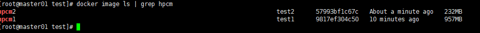

# 1. dockerfile

用于镜像的制作

## 1.1 镜像编译

```shell
docker build xxx
```

* -f: 编译文件名称, 默认Dockerfile
* -t: 指定镜像名称

# 2. 语法

## 2.1 FROM

基于什么镜像开始制作镜像, 尽量选用官方镜像, 保证安全性

```dockerfile
FROM scratch   # 基础(空镜像)镜像
# 此镜像不能pull, 但是能直接拿来用
```

## 2.2 LABEL

用于信息描述

```dockerfile
LABEL maintainer="hpcmpc@g***l.com"      # 作者
LABEL version="1.0"					     # 版本号
LABEL description="This is description"  # 描述信息
```

## 2.3 RUN/CMD/ENTRYPOINT

用于`shell`的命令运行

* RUN, 镜像编译时执行
* CMD, container运行后执行, 此参数可以作为ENTRYPOINT的变量
* ENTRYPOINT, container真正启动时执行

示例一

```dockerfile
RUN apt-get update && \
apt-get -y install vim && \
rm -rf /var/lib/apt/lists/*
# 注意使用\
# 注意清理缓存
```

示例二(shell格式)

```dockerfile
RUN apt-get -y install vim
CMD echo "hello docker"
ENTRYPOINT echo "hello docker"
```

实例三(Exec格式)

```dockerfile
RUN ["apt", "-y", "install", "vim"]
CMD ["/bin/echo", "hello docker"]
ENTRYPOINT ["/bin/echo", "hello docker"]
```

## 2.4 WORKDIR

切换工作目录

```dockerfile
WORKDIR /test
# 此代码相当于: mkdir /test && cd /test
```

## 2.5 ADD/COPY

将本地文件copy到docker镜像中去. 两者语法基本相似

ADD会解压`tar.gz`压缩包

COPY文件夹`b`到镜像里面将会变成`/a/xxx`, 而ADD则是`/a/b/xxx`

```bash
ADD [--chown=<user>:<group>] <src>... <dest>
COPY [--chown=<user>:<group>] ["<src>",... "<dest>"]
```

实例

```dockerfile
ADD --chown=55:mygroup files* /somedir/
COPY hello /
```

## 2.6 ENV

设置环境变量, 方便命令执行时使用

```dockerfile
ENV <key> <value>
ENV <key>=<value> ...
```

实例

```dockerfile
ENV myName="John Doe" myDog=Rex\ The\ Dog \
    myCat=fluffy

ENV myName John Doe
ENV myDog Rex The Dog
ENV myCat fluffy

ENV MYSQL_VERSION 5.6  # 设置常量
RUN apt -y install mysql-server="${MYSQL_VERSION}"&& \
rm -rf /var/lib/apt/lists/*
```

## 2.7 EXPOSE

端口映射,将本地端口映射docker中

```dockerfile
EXPOSE 80 80
```

## 2.8 ARG

镜像编译时, 传递参数进来

```shell
ARG a=1
# 如果--build-arg=a=3, 那么dockerfile变量a则为3
```


# 3. Dockerfile优化

## 3.1 多阶段构建镜像

1. 打包可执行程序

   ```shell
   # test.py
   import os
   
   os.system("echo 111")
   ```

2. Dockerfile

   ```shell
   FROM python:3.7.2
   
   COPY test.py /opt
   
   WORKDIR /opt
   
   RUN pip install pyinstaller -i https://mirrors.aliyun.com/pypi/simple && pyinstaller test.py
   
   RUN ls -l /opt/dist/test
   ```

3. 构建镜像

   ```shell
   docker build -t hpcm1:test1 -f ./Dockerfile
   ```

4. 查看镜像大小

   ```shell
   docker image ls | grep hpcm
   ```

5. 多阶段构建

   ```shell
   FROM python:3.7.2 as base
   
   COPY test.py /opt
   
   WORKDIR /opt
   
   RUN pip install pyinstaller -i https://mirrors.aliyun.com/pypi/simple && pyinstaller test.py
   
   RUN ls -l /opt/dist/test
   
   FROM centos:7.9.2009 
   
   COPY --from=base /opt/dist/test /opt/test
   
   WORKDIR /opt
   
   RUN chmod +x ./test/test && ./test/test
   ```
   
6. 重新构建

   ```shell
   docker build -t hpcm2:test2 .
   ```

7. 查看镜像大小

   ```shell
   docker image ls | grep hpcm
   ```

   

## 3.1 常用Dockerfile

* Python

  ```shell
  FROM python:3.7
  
  LABEL maintailer="hpcm@foxmail.com"
  LABEL version="1.0"
  LABEL description="Python 3.7 virtualenvs"
  
  ENV APP_HOME /app
  ENV PY_ENV_NAME test
  ENV PY_MIRROR https://mirrors.aliyun.com/pypi/simple
  
  RUN useradd -d $APP_HOME -ms /bin/bash app
  WORKDIR $APP_HOME
  COPY ./ $APP_HOME
  
  RUN pip install virtualenv virtualenvwrapper -i $PY_MIRROR
  
  # Set Python Virtualenv
  RUN /bin/bash -c "echo 'export VIRTUALENVWRAPPER_PYTHON=/usr/local/bin/python' > /etc/profile"
  RUN /bin/bash -c "echo 'export WORKON_HOME=$HOME/.virtualenvs' > /etc/profile"
  RUN /bin/bash -c "echo 'source /usr/local/bin/virtualenvwrapper.sh' > /etc/profile"
  
  RUN chown app:app -R ${APP_HOME}
  RUN chmod +x ${APP_HOME}/py_env
  USER app
  
  RUN ${APP_HOME}/py_env
  
  # file: py_env
  #!/bin/bash
  echo "source /etc/profile" > $HOME/.bashrc
  source /etc/profile
  
  mkvirtualenv -p python $PY_ENV_NAME
  
  pip install -r /app/requirements.txt -i $PY_MIRROR
  ```

  