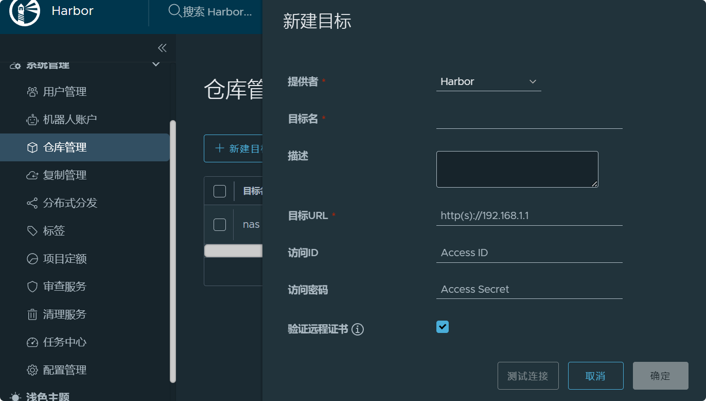

# harbor

踩坑说明:

* docker login操作一直提示证书错误, 在已经配置证书后依然报错, 经过漫长时间查找, 终于发现docker在nas中的配置文件读取是在`/var/packages/Docker/etc/certs.d/`目录下.

1. 下载

   ```shell
   # 寻找对应改本即可
   https://github.com/goharbor/harbor/releases
   # 解压, 并找到harbor.yml.tmpl, 并且改名为harbor.yml
   ```

2. 进行如下改动

   ```shell
   # harbor.yml
   # 网站地址, 如果配置就修改为自己的domain
   hostname: 0.0.0.0
   
   # http协议请求地址, 如果机器上已经部署了nginx(80端口), 那么这个端口必须要改掉
   http:
     port: 8581
   # https信息, 我这里是在nginx层进行证书认证, 所以harbor镜像内部就不再进行加密, 直接转发到http协议端口就行, 所以这里全部注释掉
   #https:
     # https port for harbor, default is 443
     #port: 8583
     # The path of cert and key files for nginx
     #certificate: /volume1/superlink/data/harbor/certs/hub.crt
     #private_key: /volume1/superlink/data/harbor/certs/hub.key
   # admin的密码, 注意修改掉
   harbor_admin_password: 12312
   
   # 数据保存路径
   data_volume: /volume1/superlink/data/harbor/data
   ```

3. 开始安装

   ```shell
   ./prepare
   ./install
   ```

4. 安装完成后将会出现9个服务, 然后把代理服务配置好, 这里需要注意

   * 由于我们采用了nginx代理, 所以原来http协议的端口记得转发, push操作需要走http协议, 而不是https协议

     ```shell
     # 代理nginx监听转发示例
     server {
     	listen 80;
     	listen 443 ssl;
     	listen 8581;
     	server_name hub.xxx.site;
     
         if ($server_port = 80) {
     	rewrite ^(.*)$ https://$host$1 permanent;
         }
         location / {
             proxy_pass http://[harbor仓库ip]:8581;
         }
     }
     
     ```

     

5. 按照密码添加我们的registry仓库

   

6. 配置完成后, 使用docker进行连接测试

   ```shell
   docker login hub.xxx.site
   ```

   注意: 此时会提示证书错误

7. 添加证书(基于群晖nas, 其他的百度即可正常解决)

   将我们自己生成的证书, 或者购买的证书, copy到`/var/packages/Docker/etc/certs.d/`文件下

   ```shell
   # 文件必须包含: client.cert(证书), client.key(私钥), ca.crt(根证书)
   mkdir /var/packages/Docker/etc/certs.d/hub.xxx.site
   cp -r certs/* /var/packages/Docker/etc/certs.d/hub.xxx.site
   ```

8. 再次进行登录, 即可正常

9. 我们创建一个tag, 准备进行push操作

   ```shell
   # library是harhor分配的项目名字, 可以直接改动
   docker tag ubuntu:16.04 hub.xxx.site/library/ubuntu:latest
   ```

10. 开始提交

    ```shell
    docker push hub.xxx.site/library/ubuntu:latest
    ```

11. 登录到harbor进行查看

    