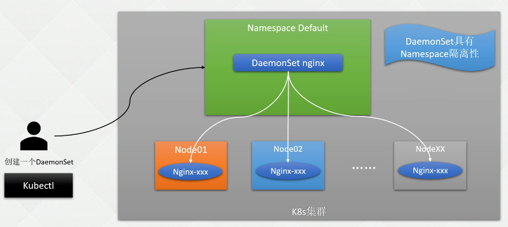

# 1. DaemonSet

## 1.1 简介

DaemonSet, 守护进程集(简称ds)

* 类似守护进程, 会在每个匹配条件的节点上部署一个Pod, 加入节点和删除节点都会自动创建和回收

应用场景:

* 集群存储的守护程序, 例如: Glusterd, Ceph, Calico等;
* 日志采集服务: Fluentd, Logstash
* 监控程序: Prometheus Node Exporter, Collectd, Datadog代理, New Relic代理, Ganglia gmond等.

部署流程:



## 1.2 操作

* yaml文件

  ```shell
  apiVersion: apps/v1
  kind: DaemonSet
  metadata:
    labels:
      app: nginx-daemonset
    name: nginx-ds
  spec:
    selector:
      matchLabels:
        app: nginx
    template:
      metadata:
        labels:
          app: nginx
      spec:
        containers:
        - image: nginx
          name: nginx
  ```

* 创建

  ```shell
  # 创建
  kubectl create -f daemonset.yaml
  ```

* 查看

  ```shell
  # 查看
  kubectl get ds -n kube-system
  ```

* 回滚

  ```shell
  # 查看版本
  kubectl get controllerrevision
  
  # 回滚指定版本
  kubectl rollout undo daemonset nginx-ds --to-revision=1
  ```

  

# 2. 命令

```yaml
...
spec:
  selector:
    matchLabels:
      app: nginx
  template:
    metadata:
      labels:
        app: nginx
    spec:
      nodeSelector:
        disktype: ssd
      containers:
      - image: nginx
        name: nginx
```