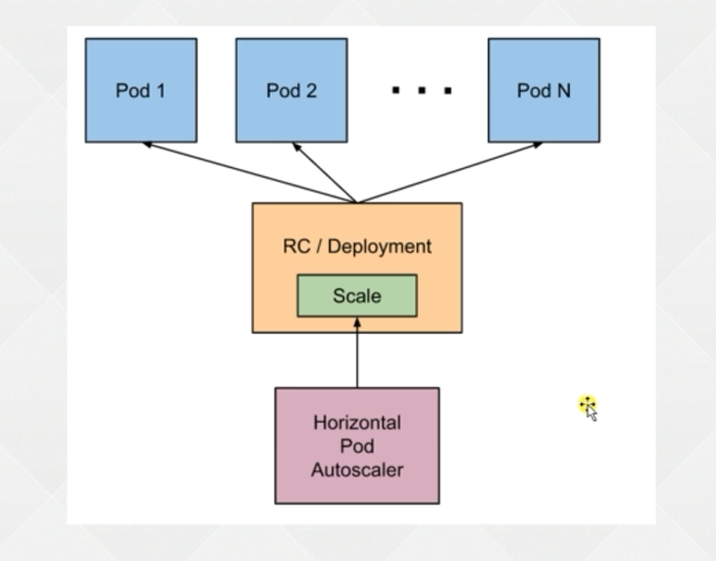

# 1. HPA

## 1.1 简介

Horizontal Pod Autoscaler, Pod水平自动缩容(简称HPA)

流程:



## 1.2 使用

接口类型:

V1: 只支持CPU

V2 beta1: 增加 内存和自定义指标

V2 beta2: 增加custom和二外的ExternalMetrics指标(公有云厂商的一些指标)

* yaml文件

  ```yaml
  apiVersion: apps/v1
  kind: Deployment
  metadata:
    labels:
      app: nginx-hpa
    name: nginx-hpa
  spec:
    replicas: 3
    selector:
      matchLabels:
        app: nginx-hpa
    template:
      metadata:
        labels:
          app: nginx-hpa
      spec:
        containers:
        - image: nginx
          name: nginx
          resources:
            requests:
              cpu: 10m
  ```

* 创建

  ```shell
  kubectl create -f HPA.yaml
  ```

* 设置扩缩容指标

  ```shell
  kubectl autoscale deployment nginx-hpa --cpu-percent=10 --min=1 --max=10
  ```

* 新建窗口执行死循环

  ```shell
  while true; do wget -q -O- http://172.164.59.220 > /dev/null; done
  ```

* 检查CPU和Pod

  ```shell
  # 查看对应pod的cpu指标
  kubectl top pod
  # 查看对应pod
  kubectl get pod
  ```

* 终止死循环, 并检查是否缩容

# 2. yaml

```yaml

```

