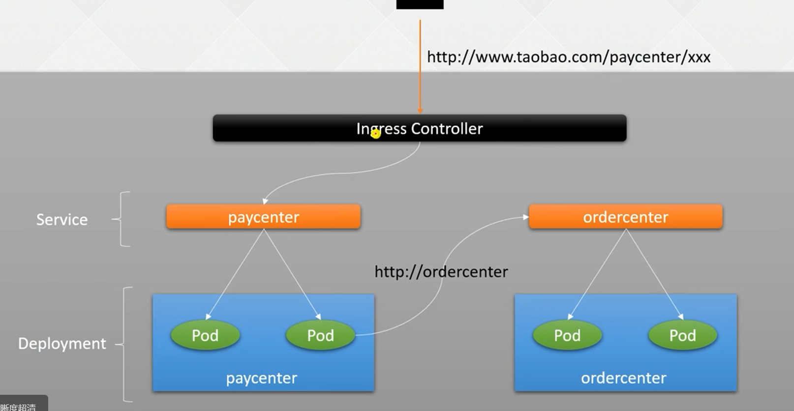

# 1. Service

## 1.1 简介

k8s服务发布常见构造



## 1.2 操作

* yaml

  ```shell
  # deployment.yaml
  apiVersion: apps/v1
  kind: Deployment
  metadata:
    labels:
      app: nginx-deploy
    name: nginx-deployment
  spec:
    replicas: 5
    selector:
      matchLabels:
        app: nginx-dpy
    strategy:
      type: Recreate
    template:
      metadata:
        labels:
          app: nginx-dpy
      spec:
        containers:
        - image: nginx
          name: nginx
  --
  # service.yaml
  kind: Service
  apiVersion: v1
  metadata:
    name: nginx-service
  spec:
    selector:
      app: nginx-dpy
    ports:
      - protocol: TCP
        port: 80  # service 端口号
        targetPort: 80  # 容器端口号, 后端服务启动的端口号
  ```

  

* 创建

  ```shell
  # 创建deployment
  kubectl create -f deployment.yaml
  
  # 确认对应的label是否存在
  kubectl get pod -l app=nginx-dpy 
  
  # 创建service
  kubectl create -f service.yaml
  ```

* 检验

  ```shell
  # 检查service
  kubectl get service
  
  # 检查service端口
  curl 10.13.146.176
  
  # 删除pod待重启, 重新检查nginx端口是否存在
  kubectl delete pod -l app=nginx-dpy
  ```

# 2. DNS

## 2.1 同Namespace

* 同一个Namespace下, 对应的name就是dns域名解析

  `nginx-deployment-777c854c8d-22b8n`和其他的是互通的, 不需要指定ip, 直接用这个名字就可以访问

  ```shell
  [root@master01 02-services]# kubectl get pod 
  NAME                                READY   STATUS    RESTARTS   AGE
  nginx-deployment-777c854c8d-22b8n   1/1     Running   0          5m
  nginx-deployment-777c854c8d-5f9wx   1/1     Running   0          5m
  nginx-deployment-777c854c8d-f8jzd   1/1     Running   0          5m
  nginx-deployment-777c854c8d-jjls6   1/1     Running   0          5m1s
  nginx-deployment-777c854c8d-rc9dp   1/1     Running   0          5m
  
  ```

## 2.2 跨Namespace

* 跨Namespace访问, 需要加上namespace前缀

  ```shell
  curl metrics-server.kube-system:443
  ```

# 3. IP代理

## 3.1 ClusterIP

只允许集群内部使用, 默认值

## 3.2 NodePort

将内部端口映射到主机, 如果搭建LVS, 可以直接使用此地址进行访问

* 示例

  ```shell
  kind: Service
  apiVersion: v1
  metadata:
    name: nginx-service
  spec:
    selector:
      app: nginx-dpy
    ports:
      - protocol: TCP
        port: 80  # service 端口号
        targetPort: 80  # 容器端口号, 后端服务启动的端口号
    type: NodePort
  ```

* 访问测试

  ```shell
  # 查看端口绑定信息
  [root@master01 02-services]# kubectl get svc | grep nginx
  nginx-service   NodePort    10.13.146.176   <none>        80:31729/TCP   43m
  
  # 80: service端口
  # 31729: 映射到k8s集群上的端口
  
  # 验证端口
  curl 10.111.0.10:31729
  curl 10.111.0.111:31729 # VIP
  ```


## 3.3 LoadBalancer

公有云的负载均衡

## 3.4 ExternalName

通过CNAME别名访问集群

* yaml

  ```yaml
  kind: Service
  apiVersion: v1
  metadata:
    name: svc-external
  spec:
    type: ExternalName
    externalName: www.baidu.com
  ```

* 创建

  ```shell
  kubectl create -f svc-external.yaml
  ```

* 验证

  ```shell
  # 查看当前生效的svc和对应域名
  kubectl get svc | grep external | awk '{print $1}'
  
  # 进入容器, 访问指定好的域名去访问
  kubectl exec -it  $(kubectl get pod | grep nginx | head -n 1 | awk '{print $1}') -- bash -c 'curl  -s -w %{http_code} svc-external'
  ```

## 3.5 将外部ip代理到k8s中

* yaml

  ```yaml
  # svc-endpoint.yaml
  apiVersion: v1
  kind: Service
  metadata:
    labels:
      app: nginx-svc-app
    name: nginx-svc-ep
  spec:
    ports:
      - name: http
        port: 80
        protocol: TCP
        targetPort: 80
    sessionAffinity: None
    type: ClusterIP
  ---
  apiVersion: v1
  kind: Endpoints
  metadata:
    labels:
      app: nginx-svc-app  # 此处要和serveice对应
    name: nginx-svc-ep  # 此处要和serveice对应
  subsets:
    - addresses:
      - ip: 140.205.94.189
      ports:
        - name: http
          port: 80
          protocol: TCP
  ```

* 创建

  ```shell
  kubectl create -f svc-endpoint.yaml
  ```

* 测试

  ```shell
  # 查看并通过代理ip, 访问外部网站
  curl `kubectl get ep | grep ep | awk '{print $2}'`
  
  # 随便找一个pod, 从容器内部尝试访问是否成功
  kubectl exec -it  $(kubectl get pod | grep nginx | head -n 1 | awk '{print $1}') -- bash -c 'curl 140.205.94.189:80'
  ```

  

