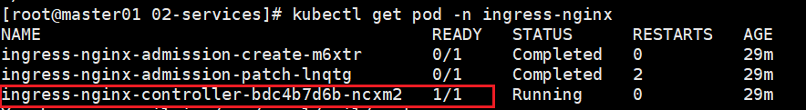

# 1. Ingress

## 1.1 简介

k8s集群的服务入口

* 提供负载均衡
* SSL终止
* 域名管理
* 灰度发布等

## 1.2 安装

官方安装文档: https://kubernetes.github.io/ingress-nginx/deploy/#bare-metal-clusters

* 下载对应yaml

* 创建安装

  ```shell
  kubectl create -f ingress.yaml
  ```

* 检测

  ```shell
  # 确保controller可用即可
  kubectl get pod -n ingress-nginx
  
  # kubectl get ingress
  ```

  

# 2. 使用

## 2.1 发布

### 2.1.1 域名发布

* yaml

  ```yaml
  # nginx-ingress.yaml
  apiVersion: networking.k8s.io/v1   # k8s >= 1.22  必须使用v1
  kind: Ingress
  metadata:
    name: nginx-ingress
  spec:
    ingressClassName: nginx
    rules:
      - host: nginx.test.com
        http:
          paths:
            - backend:
               service:
                 name: nginx-dpy
                 port:
                   number: 80
              path: /
              pathType: ImplementationSpecific
  ```
  pathType: 代理方式

  * Exact: 精确匹配
  * Prefix: 前缀匹配
  * ImplementationSpecific: 跟俊Ingress Controller来控制

* 创建

  ```shell
  kubectl create -f nginx-ingress.yaml
  ```

* 检查

  ```shell
  kubectl get ingress
  kubectl get svc
  
  # 在k8s集群外部DNS解析, 配置到/etc/hosts中
  10.111.0.11	nginx.test.com
  ```

* 检测

  ```shell
  # 查看映射出来的端口
  kubectl get svc -n ingress-nginx
  
  # 在k8s集群外部访问此域名
  curl nginx.test.com:31898
  ```

* 原理

  1. 外部hosts文件解析后, 请求`ingress-nginx`

  2. `ingress-nginx`收到请求, 利用`nginx`转发到`svc`上

     ```shell
     kubectl exec -it ingress-nginx-controller-bdc4b7d6b-ncxm2 -n ingress-nginx -- bash -c 'grep -A 20 "nginx.test.com" nginx.conf'
     ```

  3. `svc`将会利用k8sDNS特征访问到对应的`pod`中

### 2.1.2 非域名发布

只需要删除域名配置即可

* yaml

  ```shell
  # nginx-ingress.yaml
  apiVersion: networking.k8s.io/v1   # k8s >= 1.22  必须使用v1
  kind: Ingress
  metadata:
    name: nginx-ingress-no-host
  spec:
    ingressClassName: nginx
    rules:
      # - host: nginx.test.com
      - http:
          paths:
            - backend:
               service:
                 name: nginx-dpy
                 port:
                   number: 80
              path: /no-hosts
              pathType: ImplementationSpecific
  ```

* 创建后测试

  ```shell
  # 等待ADDRESS就绪
  kubectl get ingress
  
  # 测试直连访问
  curl `kubectl get pod -n ingress-nginx -owide | grep controller | awk '{print $6}'`/no-hosts
  ```

  

