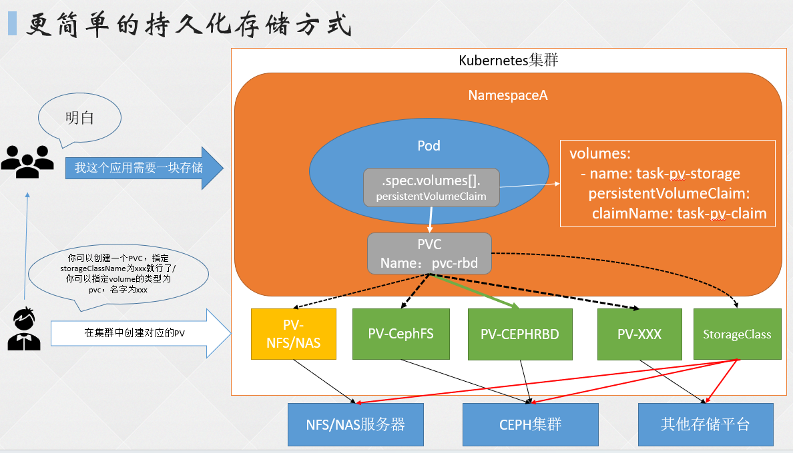

# 1. PV&PVC

## 1.1 介绍

特点:

* 增加回收策略

* 支持只读挂载
* 支持单个pod挂载
* 可以限定挂载的空间大小

PersistentVolume: 简称PV, kubernetes管理员设置的存储, 可以配置Ceph、NFS、GlusterFS等常用存储设置. 具有生命周期管理、大小限制等

PersistentVolumeClaim: 简称PVC, 是对存储PV的请求



## 1.2 使用

### 1.2.1 创建pv

* yaml

  ```yaml
  apiVersion: v1
  kind: PersistentVolume
  metadata:
    name: pv-nfs
  spec:
    capacity:
      storage: 5Gi
    volumeMode: Filesystem  # 目前仅支持文件系统和块系统
    accessModes:
      - ReadWriteOnce
    persistentVolumeReclaimPolicy: Recycle
    storageClassName: nfs-slow   # PVC绑定时, 需要指定的storageClassName
    nfs:
      path: /data/nfs/k8s-test
      server: 10.111.0.10
  ```

* 创建并查看

  ```shell
  kubectl create -f xx.yaml
  kubectl get pv
  ```

### 1.2.2 创建pvc

* yaml

  ```yaml
  apiVersion: v1
  kind: PersistentVolumeClaim
  metadata:
    name: nfs-pvc
  spec:
    storageClassName: nfs-slow  # 对应PV的storageClassName
    accessModes:
      - ReadWriteOnce
    resources:
      requests:
        storage: 3Gi  # 必须 PV <= PVC
  ```

* 创建并查看

  ```yaml
  kubectl create -f xx.yaml
  kubectl get pvc
  ```

### 1.2.3 服务引用

* yaml

  ```yaml
  apiVersion: apps/v1
  kind: Deployment
  metadata:
    labels:
      app: nginx-deploy
    name: nginx-deployment
  spec:
    replicas: 1
    selector:
      matchLabels:
        app: nginx
    strategy:
      type: Recreate
    template:
      metadata:
        labels:
          app: nginx
      spec:
        containers:
          - image: nginx
            name: nginx
            volumeMounts:
              - mountPath: '/usr/share/nginx/html'
                name: pvc-storage
        volumes:
          - name: pvc-storage
            persistentVolumeClaim:
              claimName: nfs-pvc  # 引用对应pvc
  ```

* 创建

  ```yaml
  kubectl create -f xx.yaml
  ```

* 校验

  ```shell
  # 创建index.html
  echo 123 > index.html
  
  # 验证, 大概生效需要30s
  curl $(kubectl get pod -owide | grep nginx-deployment | awk '{print $6}')
  ```

# 2. yaml

回收机制

* Retain: 保留, 需要管理员手动删除
* Recycle: 回收, 直接`rm -rf`删除PV, 并且可以用于下一个新的PVC操作
* Delete: 删除, 删除PVC的同时, 删除PV, 动态卷默认为Delete

访问策略

* ReadWriteOnce: 可以被单节点以读写模式挂载, 简写为RWO
* ReadOnlyMany: 可以被多节点以只读模式挂载, 简写为ROX
* ReadWriteMany: 可以被多节点以读写模式挂载, 简写为RWX

存储分类

* 文件存储: 一些数据可能需要多个节点使用, 比如用户的头像、文件等, 实现方式: NFS、NAS、FTP等。
* 块存储: 一些数据只能被一个节点使用, 比如数据库、Redis等, 实现方式: Ceph、ClusterFS、公有云。
* 对象存储: 由程序代码实现的一中存储方式, 实现方式: s3协议的存储, Minio等.

# 3. 挂载失败原因

* PVC申请空间 > PV的空间
* PVC StorageClassName和PV不一致
* PVC accessModes和PV不一致