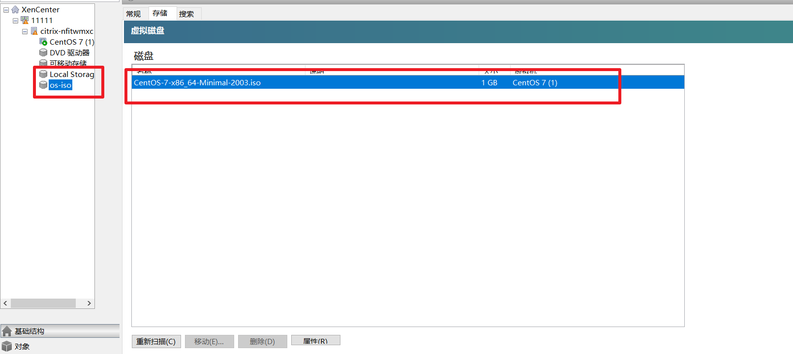

1. 确保存在可以使用的硬盘

2. 进入服务器开始分配ISO存储盘

   ```shell
   # 分配一个空间, 用于ISO镜像存储
   mkdir -p /usr/local/os-iso
   xe sr-create name-label=os-iso type=iso device-config:location=/usr/local/os-iso device-config:legacy_mode=true content-type=iso
   ```

3. 利用sftp, 向这个文件中导入需要安装的镜像

4. 此时保证在XenCenter中能查看到自己构建的两个文件, 并且ISO是存在的

   

5. 构建vm, 我这里分配少了, 所以无法添加, 磁盘空间需要够系统安装使用才可以进行, 否则就无法操作

   


6. 安装完成后, 后面的操作就是系统安装流程