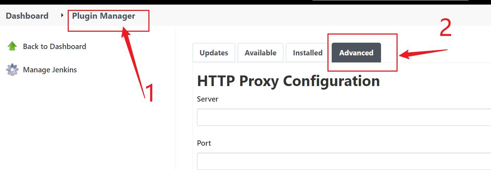
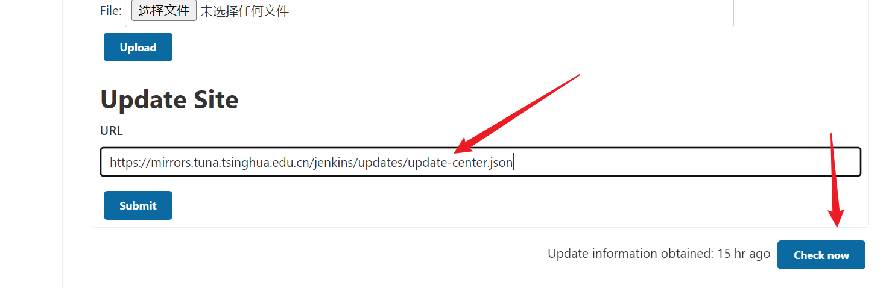
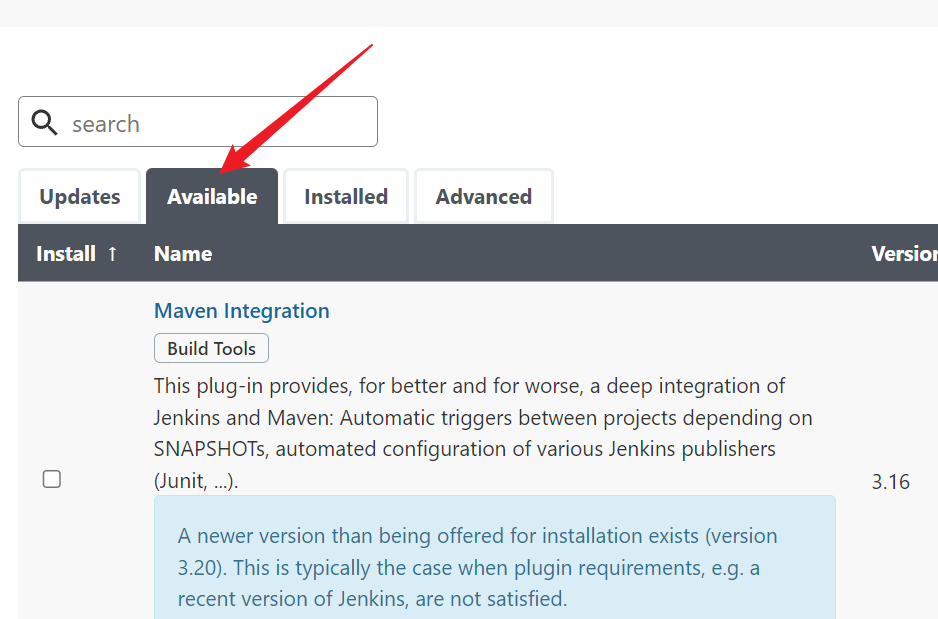

# 1. 安装

官网: https://www.jenkins.io/download/

## 1.1 Docker安装

* 创建挂载文件

  ```shell
  mkdir -p /data/jenkins_data
  chmod -R 777  /data/jenkins_data
  ```

* 运行container

  ```shell
  docker run -d \
  --name=jenkins \
  -e JENKINS_PASSWORD=admin123 \
  -e JENKINS_USERNAME=admin \
  -e JENKINS_HTTP_PORT_NUMBER=8080 \
  -p 4080:8080 \
  -p 4500:50000 \
  -v /data/jenkins_data:/bitnami/jenkins \
  bitnami/jenkins:2.319.1-debian-10-r25
  ```

* 检查端口

  ```shell
  # 耐心等到服务启动, 大概需要5分钟
  netstat nlp | grep 4080
  ```

# 2. 配置

## 2.2 插件安装

### 2.2.1 镜像源修改

* 修改镜像源

  



* 输入内容如下

  ```shell
  https://mirrors.tuna.tsinghua.edu.cn/jenkins/updates/update-center.json
  ```

### 2.2.2 安装插件

* 安装

  

* 按照需要安装, 点击Download now and install after restart

* 页面跳转安装进度页面后, 滑动到最下面, 勾选重启生效

  注意: 有可能会出现最后几个一直处于Pending状态, 刷新页面即可