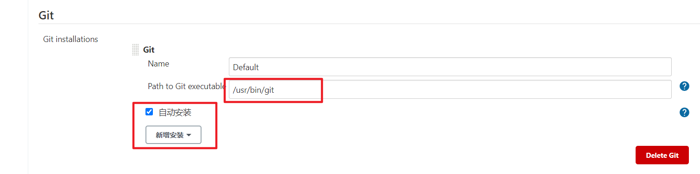
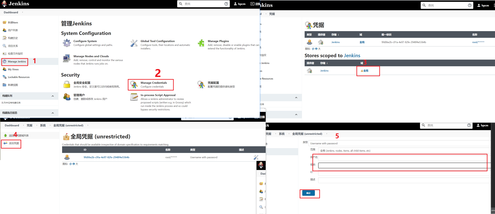
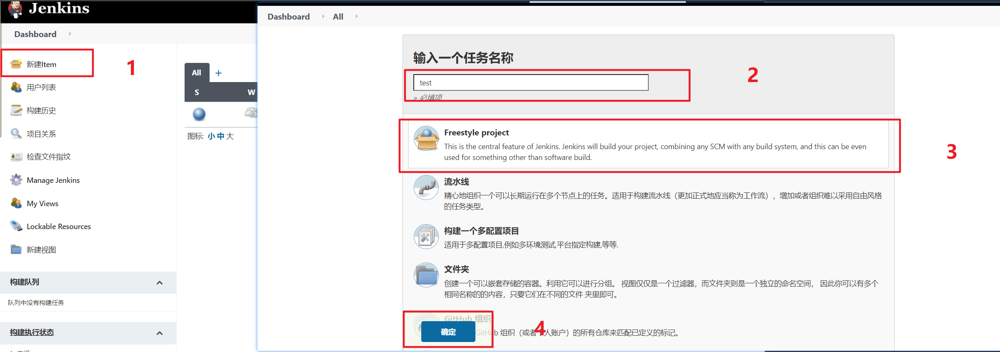
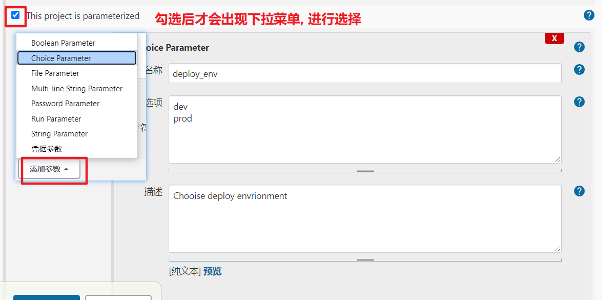
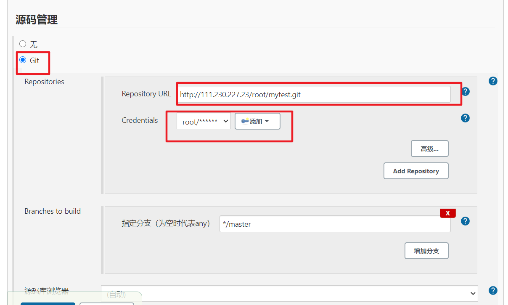
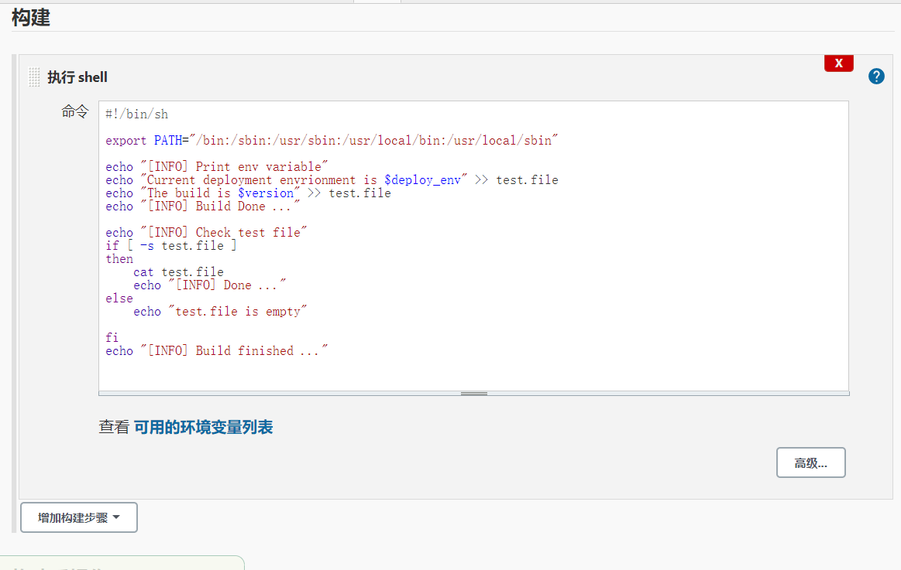

# 1. 在线安装

```shell
# 1. 下载仓库位置
wget -O /etc/yum.repos.d/jenkins.repo http://pkg.jenkins.io/redhat-stable/jenkins.repo
# 2. 导入key, 失败可以不用管
rpm --import https://pkg.jenkins.io/redhat-stable/jenkins.io.key
# 3. 安装java环境, 因为jenkins是基于java开发的
yum install java
# 4. 关闭防火墙
systemctl stop firewalld
systemctl disable firewalld
# 5. 关闭selinux
vi /etc/sysconfig/selinux
## SELINUX=disabled 注意重启系统生效
# 6. 启动jenkins
systemctl start jenkins
```

# 2. 配置web页面

直接访问: `localhost:8080`

密码: `cat /var/lib/jenkins/secrets/initialAdminPassword`

按照指定操作进行配置即可


# 3. 配置jenkins

## 3.1 配置git插件

点击Manage Jenkins -- Global Tool Configuration



## 3.2 配置git账号



# 4. 配置工程

## 4.1 `freestyle`

### 4.1.1 创建一个任务



### 4.1.2 配置任务

进入设置页面

1. 任务描述信息

   第一行

2. 项目变量

   此变量在项目启动时, 直接传递到shell中,

   

3. git配置

   


 4. 构建shell任务

    

## 4.2 Pipeline Job

